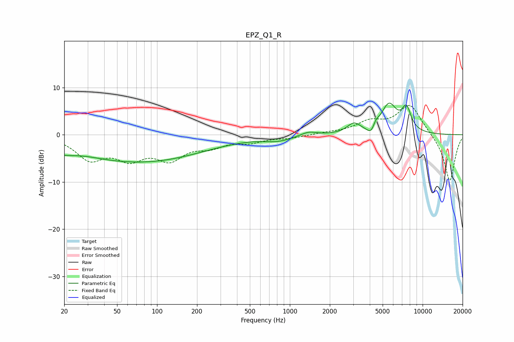

# EPZ_Q1_R
See [usage instructions](https://github.com/jaakkopasanen/AutoEq#usage) for more options and info.

### Parametric EQs
Apply preamp of -6.8 dB when using parametric equalizer.

|   # | Type    |   Fc (Hz) |    Q |   Gain (dB) |
|-----|---------|-----------|------|-------------|
|   1 | Peaking |        28 | 0.92 |         1.1 |
|   2 | Peaking |        35 | 0.23 |        -5.4 |
|   3 | Peaking |       157 | 0.43 |        -1.9 |
|   4 | Peaking |       817 | 1.35 |        -1   |
|   5 | Peaking |      1383 | 2.38 |         0.9 |
|   6 | Peaking |      3038 | 2.83 |         2.1 |
|   7 | Peaking |      4137 | 4.25 |        -2.2 |
|   8 | Peaking |      4421 | 5.8  |         1.5 |
|   9 | Peaking |      5577 | 2.3  |         6.1 |
|  10 | Peaking |      7555 | 3.84 |         4.6 |

### Fixed Band EQs
When using fixed band (also called graphic) equalizer, apply preamp of **-6.3 dB** (if available) and set gains manually with these parameters.

|   # | Type    |   Fc (Hz) |    Q |   Gain (dB) |
|-----|---------|-----------|------|-------------|
|   1 | Peaking |        31 | 1.41 |        -4.8 |
|   2 | Peaking |        62 | 1.41 |        -4.3 |
|   3 | Peaking |       125 | 1.41 |        -4.6 |
|   4 | Peaking |       250 | 1.41 |        -2   |
|   5 | Peaking |       500 | 1.41 |        -1.3 |
|   6 | Peaking |      1000 | 1.41 |        -0.6 |
|   7 | Peaking |      2000 | 1.41 |         0.3 |
|   8 | Peaking |      4000 | 1.41 |         2.5 |
|   9 | Peaking |      8000 | 1.41 |         6.4 |
|  10 | Peaking |     16000 | 1.41 |       -10   |

### Graphs

