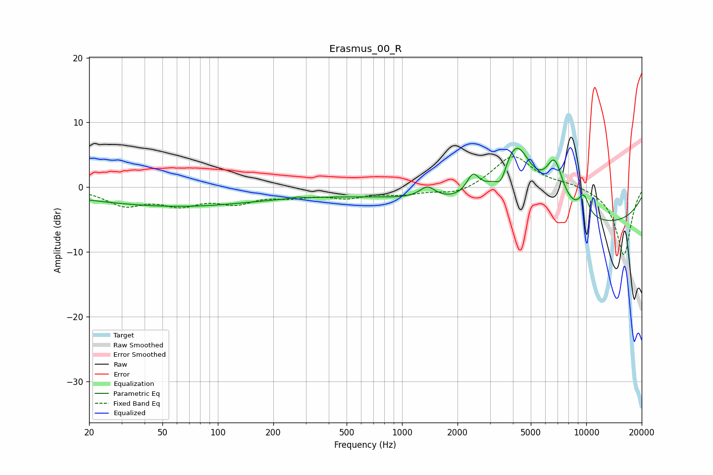

# Erasmus_00_R
See [usage instructions](https://github.com/jaakkopasanen/AutoEq#usage) for more options and info.

### Parametric EQs
Apply preamp of -6.1 dB when using parametric equalizer.

|   # | Type    |   Fc (Hz) |    Q |   Gain (dB) |
|-----|---------|-----------|------|-------------|
|   1 | Peaking |        44 | 0.3  |        -2.3 |
|   2 | Peaking |       264 | 0.18 |        -1.1 |
|   3 | Peaking |       270 | 5.96 |         0.2 |
|   4 | Peaking |      1373 | 3.24 |         1.8 |
|   5 | Peaking |      2426 | 4.13 |         3.1 |
|   6 | Peaking |      3446 | 4.99 |        -2.4 |
|   7 | Peaking |      4164 | 1.48 |        11.1 |
|   8 | Peaking |      6735 | 2.82 |         6.9 |
|   9 | Peaking |      8916 | 0.19 |        -6.2 |
|  10 | Peaking |      9708 | 4.3  |         3.1 |

### Fixed Band EQs
When using fixed band (also called graphic) equalizer, apply preamp of **-4.8 dB** (if available) and set gains manually with these parameters.

|   # | Type    |   Fc (Hz) |    Q |   Gain (dB) |
|-----|---------|-----------|------|-------------|
|   1 | Peaking |        31 | 1.41 |        -2.6 |
|   2 | Peaking |        62 | 1.41 |        -2.3 |
|   3 | Peaking |       125 | 1.41 |        -2.1 |
|   4 | Peaking |       250 | 1.41 |        -1.1 |
|   5 | Peaking |       500 | 1.41 |        -1.4 |
|   6 | Peaking |      1000 | 1.41 |        -0.9 |
|   7 | Peaking |      2000 | 1.41 |        -1.2 |
|   8 | Peaking |      4000 | 1.41 |         5   |
|   9 | Peaking |      8000 | 1.41 |         0.5 |
|  10 | Peaking |     16000 | 1.41 |       -10.6 |

### Graphs

