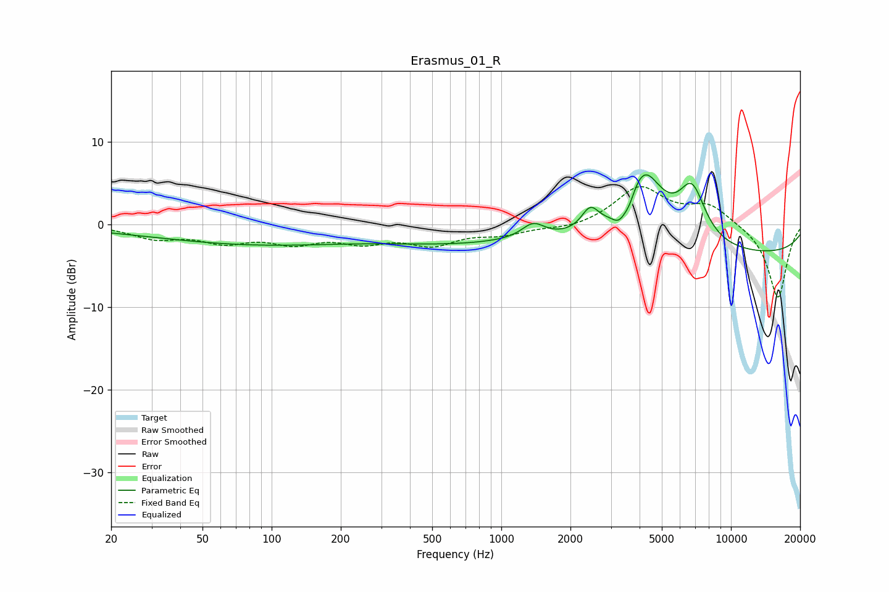

# Erasmus_01_R
See [usage instructions](https://github.com/jaakkopasanen/AutoEq#usage) for more options and info.

### Parametric EQs
Apply preamp of -6.1 dB when using parametric equalizer.

|   # | Type    |   Fc (Hz) |    Q |   Gain (dB) |
|-----|---------|-----------|------|-------------|
|   1 | Peaking |        74 | 0.19 |        -0.8 |
|   2 | Peaking |        87 | 0.36 |        -1.6 |
|   3 | Peaking |       646 | 0.44 |        -1.8 |
|   4 | Peaking |      1376 | 2.85 |         1.8 |
|   5 | Peaking |      2438 | 3.73 |         2.6 |
|   6 | Peaking |      3273 | 4.32 |        -2   |
|   7 | Peaking |      3618 | 5.98 |        -1.2 |
|   8 | Peaking |      4158 | 1.61 |         8.8 |
|   9 | Peaking |      6765 | 2.27 |         6.4 |
|  10 | Peaking |     10000 | 0.18 |        -3.7 |

### Fixed Band EQs
When using fixed band (also called graphic) equalizer, apply preamp of **-4.7 dB** (if available) and set gains manually with these parameters.

|   # | Type    |   Fc (Hz) |    Q |   Gain (dB) |
|-----|---------|-----------|------|-------------|
|   1 | Peaking |        31 | 1.41 |        -1.5 |
|   2 | Peaking |        62 | 1.41 |        -1.8 |
|   3 | Peaking |       125 | 1.41 |        -1.9 |
|   4 | Peaking |       250 | 1.41 |        -1.8 |
|   5 | Peaking |       500 | 1.41 |        -2.2 |
|   6 | Peaking |      1000 | 1.41 |        -1   |
|   7 | Peaking |      2000 | 1.41 |        -0.6 |
|   8 | Peaking |      4000 | 1.41 |         4.5 |
|   9 | Peaking |      8000 | 1.41 |         2.3 |
|  10 | Peaking |     16000 | 1.41 |        -9   |

### Graphs

