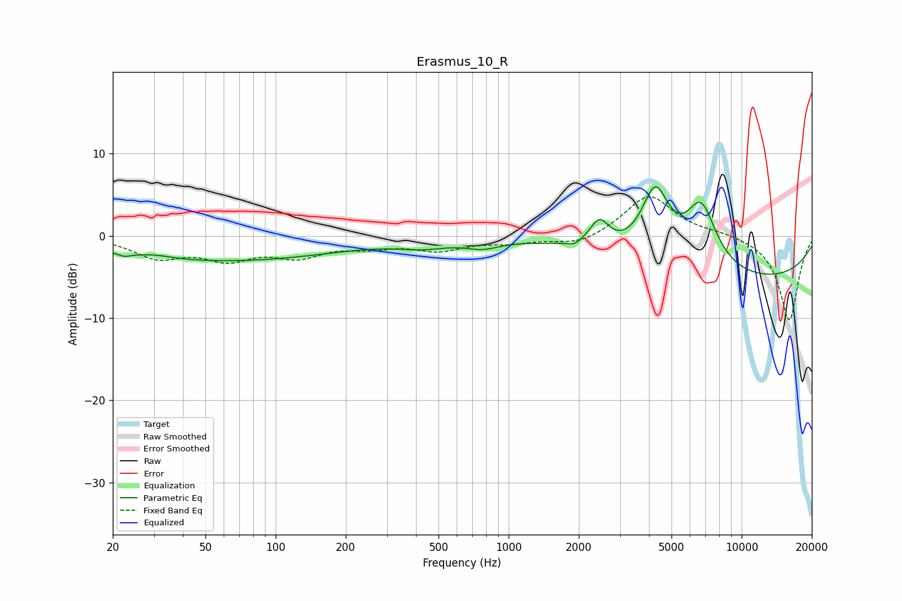

# Erasmus_10_R
See [usage instructions](https://github.com/jaakkopasanen/AutoEq#usage) for more options and info.

### Parametric EQs
Apply preamp of -6.1 dB when using parametric equalizer.

|   # | Type    |   Fc (Hz) |    Q |   Gain (dB) |
|-----|---------|-----------|------|-------------|
|   1 | Peaking |        22 | 5.88 |        -0.4 |
|   2 | Peaking |        31 | 2.14 |         0.3 |
|   3 | Peaking |        58 | 0.27 |        -3   |
|   4 | Peaking |       430 | 1.31 |        -0.9 |
|   5 | Peaking |       774 | 1.97 |        -0.9 |
|   6 | Peaking |      1914 | 5.46 |        -0.5 |
|   7 | Peaking |      2451 | 3.44 |         3.2 |
|   8 | Peaking |      4260 | 2.31 |         8.4 |
|   9 | Peaking |      6702 | 2.01 |         7.7 |
|  10 | Peaking |     10000 | 0.24 |        -5.4 |

### Fixed Band EQs
When using fixed band (also called graphic) equalizer, apply preamp of **-4.8 dB** (if available) and set gains manually with these parameters.

|   # | Type    |   Fc (Hz) |    Q |   Gain (dB) |
|-----|---------|-----------|------|-------------|
|   1 | Peaking |        31 | 1.41 |        -2.4 |
|   2 | Peaking |        62 | 1.41 |        -2.5 |
|   3 | Peaking |       125 | 1.41 |        -2.2 |
|   4 | Peaking |       250 | 1.41 |        -1.1 |
|   5 | Peaking |       500 | 1.41 |        -1.6 |
|   6 | Peaking |      1000 | 1.41 |        -0.7 |
|   7 | Peaking |      2000 | 1.41 |        -1.2 |
|   8 | Peaking |      4000 | 1.41 |         5   |
|   9 | Peaking |      8000 | 1.41 |         0.4 |
|  10 | Peaking |     16000 | 1.41 |       -10.3 |

### Graphs

