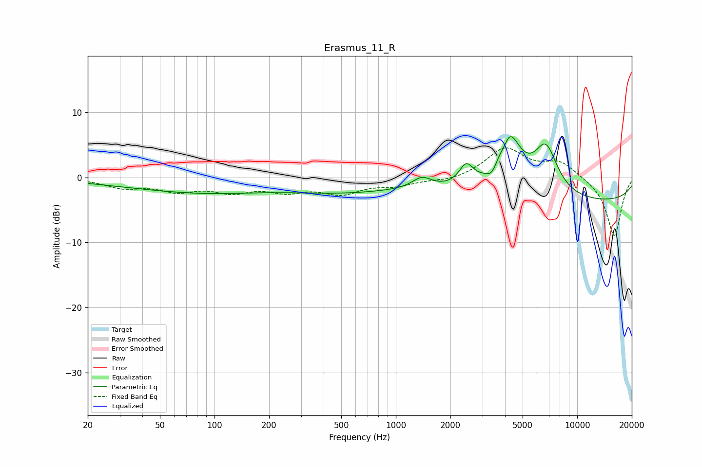

# Erasmus_11_R
See [usage instructions](https://github.com/jaakkopasanen/AutoEq#usage) for more options and info.

### Parametric EQs
Apply preamp of -6.4 dB when using parametric equalizer.

|   # | Type    |   Fc (Hz) |    Q |   Gain (dB) |
|-----|---------|-----------|------|-------------|
|   1 | Peaking |        62 | 0.33 |        -1.4 |
|   2 | Peaking |        98 | 0.49 |        -0.8 |
|   3 | Peaking |       515 | 0.42 |        -2   |
|   4 | Peaking |      1393 | 2.72 |         1.7 |
|   5 | Peaking |      2445 | 3.6  |         3.1 |
|   6 | Peaking |      3390 | 4.48 |        -1.8 |
|   7 | Peaking |      3968 | 5.97 |        -1.2 |
|   8 | Peaking |      4174 | 2.09 |         9.2 |
|   9 | Peaking |      6716 | 2.06 |         7.3 |
|  10 | Peaking |     10000 | 0.18 |        -3.9 |

### Fixed Band EQs
When using fixed band (also called graphic) equalizer, apply preamp of **-4.6 dB** (if available) and set gains manually with these parameters.

|   # | Type    |   Fc (Hz) |    Q |   Gain (dB) |
|-----|---------|-----------|------|-------------|
|   1 | Peaking |        31 | 1.41 |        -1.4 |
|   2 | Peaking |        62 | 1.41 |        -1.8 |
|   3 | Peaking |       125 | 1.41 |        -1.9 |
|   4 | Peaking |       250 | 1.41 |        -1.8 |
|   5 | Peaking |       500 | 1.41 |        -2.2 |
|   6 | Peaking |      1000 | 1.41 |        -1.1 |
|   7 | Peaking |      2000 | 1.41 |        -0.6 |
|   8 | Peaking |      4000 | 1.41 |         4.5 |
|   9 | Peaking |      8000 | 1.41 |         2.3 |
|  10 | Peaking |     16000 | 1.41 |        -9.1 |

### Graphs

