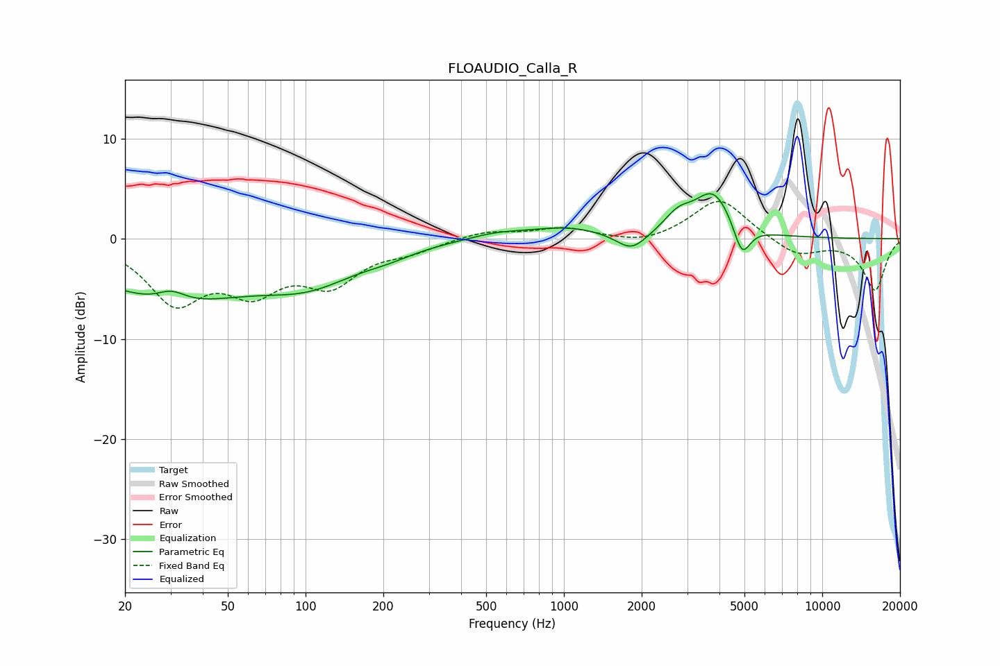

# FLOAUDIO_Calla_R
See [usage instructions](https://github.com/jaakkopasanen/AutoEq#usage) for more options and info.

### Parametric EQs
Apply preamp of -4.6 dB when using parametric equalizer.

|   # | Type    |   Fc (Hz) |    Q |   Gain (dB) |
|-----|---------|-----------|------|-------------|
|   1 | Peaking |        30 | 0.46 |        -5.9 |
|   2 | Peaking |        30 | 2.61 |         1.2 |
|   3 | Peaking |       104 | 0.74 |        -3.3 |
|   4 | Peaking |       210 | 1.45 |        -0.6 |
|   5 | Peaking |       543 | 1.34 |         0.5 |
|   6 | Peaking |      1014 | 0.93 |         1.1 |
|   7 | Peaking |      1826 | 2.4  |        -1.9 |
|   8 | Peaking |      2767 | 2.6  |         1.7 |
|   9 | Peaking |      3791 | 1.9  |         4.5 |
|  10 | Peaking |      4890 | 4.33 |        -3.3 |

### Fixed Band EQs
When using fixed band (also called graphic) equalizer, apply preamp of **-3.8 dB** (if available) and set gains manually with these parameters.

|   # | Type    |   Fc (Hz) |    Q |   Gain (dB) |
|-----|---------|-----------|------|-------------|
|   1 | Peaking |        31 | 1.41 |        -5.9 |
|   2 | Peaking |        62 | 1.41 |        -4.4 |
|   3 | Peaking |       125 | 1.41 |        -4   |
|   4 | Peaking |       250 | 1.41 |        -1   |
|   5 | Peaking |       500 | 1.41 |         0.8 |
|   6 | Peaking |      1000 | 1.41 |         1   |
|   7 | Peaking |      2000 | 1.41 |        -0.7 |
|   8 | Peaking |      4000 | 1.41 |         4.1 |
|   9 | Peaking |      8000 | 1.41 |        -1.7 |
|  10 | Peaking |     16000 | 1.41 |        -5.1 |

### Graphs

