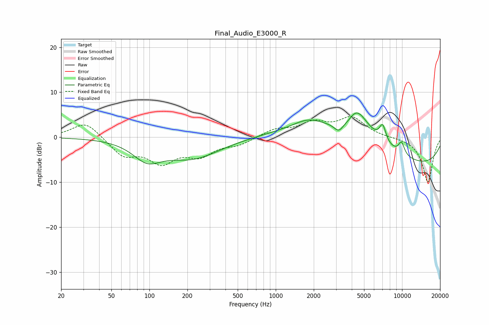

# Final_Audio_E3000_R
See [usage instructions](https://github.com/jaakkopasanen/AutoEq#usage) for more options and info.

### Parametric EQs
Apply preamp of -5.5 dB when using parametric equalizer.

|   # | Type    |   Fc (Hz) |    Q |   Gain (dB) |
|-----|---------|-----------|------|-------------|
|   1 | Peaking |        96 | 1.28 |        -4   |
|   2 | Peaking |       219 | 0.64 |        -4.5 |
|   3 | Peaking |      1810 | 1.18 |         2.2 |
|   4 | Peaking |      3163 | 3.53 |        -2.3 |
|   5 | Peaking |      3568 | 0.32 |         5.1 |
|   6 | Peaking |      3778 | 3.09 |        -1.2 |
|   7 | Peaking |      4313 | 1.41 |         7.1 |
|   8 | Peaking |      7023 | 5    |         3.8 |
|   9 | Peaking |      9420 | 0.2  |        -7.3 |
|  10 | Peaking |      9892 | 5.05 |         2.7 |

### Fixed Band EQs
When using fixed band (also called graphic) equalizer, apply preamp of **-4.7 dB** (if available) and set gains manually with these parameters.

|   # | Type    |   Fc (Hz) |    Q |   Gain (dB) |
|-----|---------|-----------|------|-------------|
|   1 | Peaking |        31 | 1.41 |         3.6 |
|   2 | Peaking |        62 | 1.41 |        -3.9 |
|   3 | Peaking |       125 | 1.41 |        -5   |
|   4 | Peaking |       250 | 1.41 |        -3.5 |
|   5 | Peaking |       500 | 1.41 |        -1.5 |
|   6 | Peaking |      1000 | 1.41 |         1.7 |
|   7 | Peaking |      2000 | 1.41 |         2.9 |
|   8 | Peaking |      4000 | 1.41 |         4.2 |
|   9 | Peaking |      8000 | 1.41 |        -0   |
|  10 | Peaking |     16000 | 1.41 |       -10   |

### Graphs

