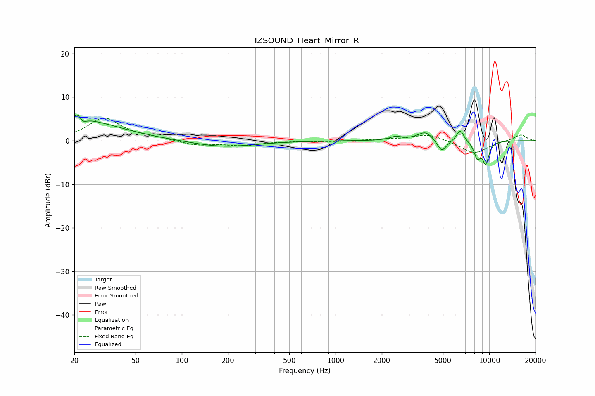

# HZSOUND_Heart_Mirror_R
See [usage instructions](https://github.com/jaakkopasanen/AutoEq#usage) for more options and info.

### Parametric EQs
Apply preamp of -5.9 dB when using parametric equalizer.

|   # | Type    |   Fc (Hz) |    Q |   Gain (dB) |
|-----|---------|-----------|------|-------------|
|   1 | Peaking |        20 | 0.53 |         5   |
|   2 | Peaking |        21 | 5.9  |         1.8 |
|   3 | Peaking |        22 | 5.78 |        -1.5 |
|   4 | Peaking |       186 | 0.72 |        -1.5 |
|   5 | Peaking |      2469 | 3.7  |         0.8 |
|   6 | Peaking |      3847 | 2.76 |         2.1 |
|   7 | Peaking |      4912 | 4.5  |        -2.9 |
|   8 | Peaking |      6474 | 5.71 |         2.7 |
|   9 | Peaking |      8370 | 5.71 |        -3.5 |
|  10 | Peaking |      9494 | 6    |        -4.8 |

### Fixed Band EQs
When using fixed band (also called graphic) equalizer, apply preamp of **-5.3 dB** (if available) and set gains manually with these parameters.

|   # | Type    |   Fc (Hz) |    Q |   Gain (dB) |
|-----|---------|-----------|------|-------------|
|   1 | Peaking |        31 | 1.41 |         5.1 |
|   2 | Peaking |        62 | 1.41 |         0.6 |
|   3 | Peaking |       125 | 1.41 |        -1.1 |
|   4 | Peaking |       250 | 1.41 |        -1   |
|   5 | Peaking |       500 | 1.41 |        -0.1 |
|   6 | Peaking |      1000 | 1.41 |        -0.2 |
|   7 | Peaking |      2000 | 1.41 |         0.3 |
|   8 | Peaking |      4000 | 1.41 |         1.6 |
|   9 | Peaking |      8000 | 1.41 |        -3   |
|  10 | Peaking |     16000 | 1.41 |         1.4 |

### Graphs

