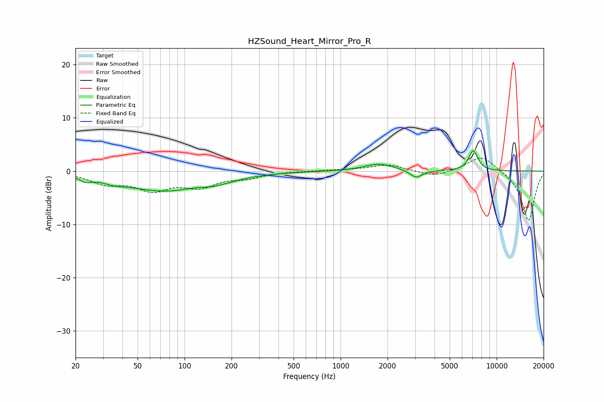

# HZSound_Heart_Mirror_Pro_R
See [usage instructions](https://github.com/jaakkopasanen/AutoEq#usage) for more options and info.

### Parametric EQs
Apply preamp of -3.9 dB when using parametric equalizer.

|   # | Type    |   Fc (Hz) |    Q |   Gain (dB) |
|-----|---------|-----------|------|-------------|
|   1 | Peaking |        23 | 3.85 |        -0.9 |
|   2 | Peaking |        35 | 2.13 |        -0.6 |
|   3 | Peaking |        76 | 0.52 |        -3.7 |
|   4 | Peaking |       115 | 1.43 |         0.4 |
|   5 | Peaking |       117 | 1.3  |         0.2 |
|   6 | Peaking |       142 | 0.99 |        -0.3 |
|   7 | Peaking |       153 | 1.18 |        -0.8 |
|   8 | Peaking |      1761 | 1.51 |         1.4 |
|   9 | Peaking |      3050 | 3.62 |        -1.5 |
|  10 | Peaking |      7085 | 4.59 |         3.8 |

### Fixed Band EQs
When using fixed band (also called graphic) equalizer, apply preamp of **-2.5 dB** (if available) and set gains manually with these parameters.

|   # | Type    |   Fc (Hz) |    Q |   Gain (dB) |
|-----|---------|-----------|------|-------------|
|   1 | Peaking |        31 | 1.41 |        -2.1 |
|   2 | Peaking |        62 | 1.41 |        -3.2 |
|   3 | Peaking |       125 | 1.41 |        -2.6 |
|   4 | Peaking |       250 | 1.41 |        -1   |
|   5 | Peaking |       500 | 1.41 |         0   |
|   6 | Peaking |      1000 | 1.41 |         0.2 |
|   7 | Peaking |      2000 | 1.41 |         1.2 |
|   8 | Peaking |      4000 | 1.41 |        -1.2 |
|   9 | Peaking |      8000 | 1.41 |         3.1 |
|  10 | Peaking |     16000 | 1.41 |        -9.4 |

### Graphs

