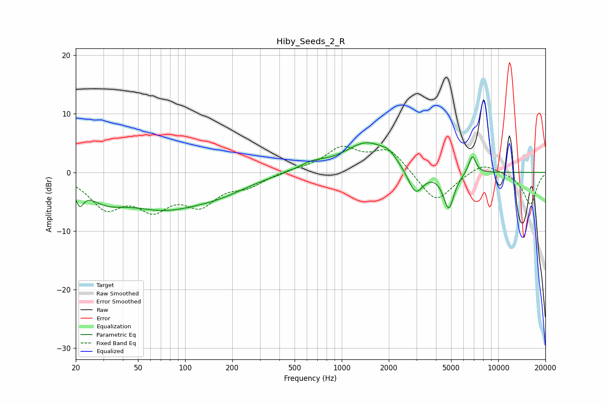

# Hiby_Seeds_2_R
See [usage instructions](https://github.com/jaakkopasanen/AutoEq#usage) for more options and info.

### Parametric EQs
Apply preamp of -5.1 dB when using parametric equalizer.

|   # | Type    |   Fc (Hz) |    Q |   Gain (dB) |
|-----|---------|-----------|------|-------------|
|   1 | Peaking |        21 | 5.74 |        -2.8 |
|   2 | Peaking |        31 | 1.22 |        -2.7 |
|   3 | Peaking |        73 | 0.52 |        -5.6 |
|   4 | Peaking |       171 | 0.78 |        -1.7 |
|   5 | Peaking |       645 | 1.52 |         1.3 |
|   6 | Peaking |      1442 | 1    |         5   |
|   7 | Peaking |      2001 | 2.85 |         1.2 |
|   8 | Peaking |      2960 | 2.86 |        -4.5 |
|   9 | Peaking |      4824 | 4    |        -6.3 |
|  10 | Peaking |      6824 | 5.8  |         3.1 |

### Fixed Band EQs
When using fixed band (also called graphic) equalizer, apply preamp of **-4.5 dB** (if available) and set gains manually with these parameters.

|   # | Type    |   Fc (Hz) |    Q |   Gain (dB) |
|-----|---------|-----------|------|-------------|
|   1 | Peaking |        31 | 1.41 |        -5.5 |
|   2 | Peaking |        62 | 1.41 |        -5.2 |
|   3 | Peaking |       125 | 1.41 |        -4.8 |
|   4 | Peaking |       250 | 1.41 |        -2   |
|   5 | Peaking |       500 | 1.41 |         0.4 |
|   6 | Peaking |      1000 | 1.41 |         3.9 |
|   7 | Peaking |      2000 | 1.41 |         3.9 |
|   8 | Peaking |      4000 | 1.41 |        -5.3 |
|   9 | Peaking |      8000 | 1.41 |         1.8 |
|  10 | Peaking |     16000 | 1.41 |        -5.5 |

### Graphs

