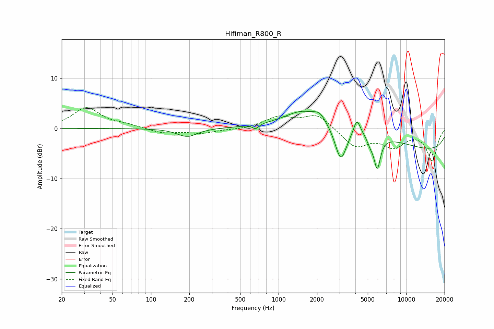

# Hifiman_R800_R
See [usage instructions](https://github.com/jaakkopasanen/AutoEq#usage) for more options and info.

### Parametric EQs
Apply preamp of -3.5 dB when using parametric equalizer.

|   # | Type    |   Fc (Hz) |    Q |   Gain (dB) |
|-----|---------|-----------|------|-------------|
|   1 | Peaking |       192 | 1.79 |        -1.7 |
|   2 | Peaking |       662 | 5.99 |        -0.9 |
|   3 | Peaking |      1516 | 1.16 |         2.3 |
|   4 | Peaking |      2105 | 2.86 |         1.7 |
|   5 | Peaking |      3074 | 3.03 |        -7.1 |
|   6 | Peaking |      3663 | 0.32 |         4   |
|   7 | Peaking |      4115 | 5.19 |         3.2 |
|   8 | Peaking |      5233 | 5.62 |        -1.3 |
|   9 | Peaking |      5933 | 5.36 |        -6.4 |
|  10 | Peaking |      9978 | 0.18 |        -5.1 |

### Fixed Band EQs
When using fixed band (also called graphic) equalizer, apply preamp of **-4.2 dB** (if available) and set gains manually with these parameters.

|   # | Type    |   Fc (Hz) |    Q |   Gain (dB) |
|-----|---------|-----------|------|-------------|
|   1 | Peaking |        31 | 1.41 |         4.1 |
|   2 | Peaking |        62 | 1.41 |         0.6 |
|   3 | Peaking |       125 | 1.41 |        -1   |
|   4 | Peaking |       250 | 1.41 |        -0.9 |
|   5 | Peaking |       500 | 1.41 |        -0.2 |
|   6 | Peaking |      1000 | 1.41 |         2.2 |
|   7 | Peaking |      2000 | 1.41 |         2.8 |
|   8 | Peaking |      4000 | 1.41 |        -3.6 |
|   9 | Peaking |      8000 | 1.41 |        -3.3 |
|  10 | Peaking |     16000 | 1.41 |        -6.3 |

### Graphs

