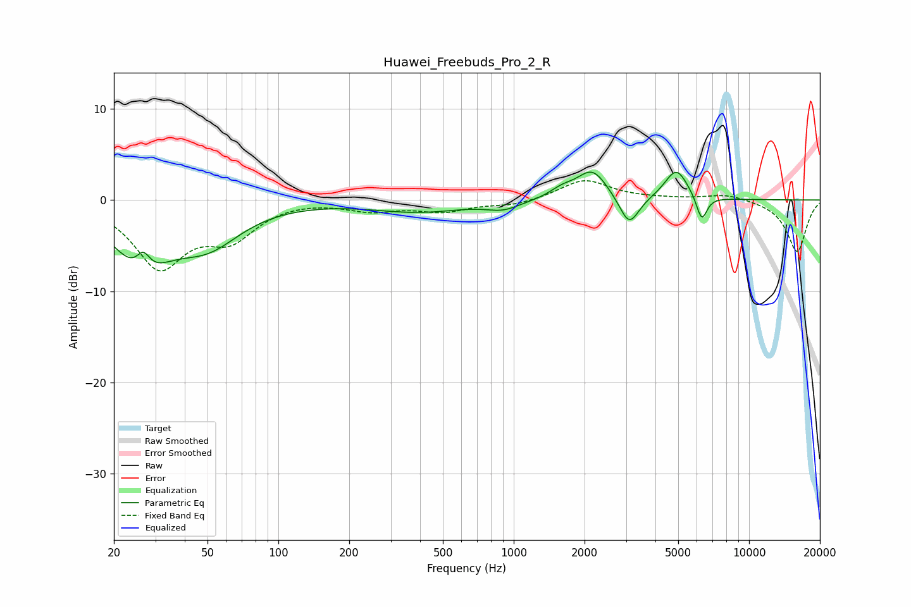

# Huawei_Freebuds_Pro_2_R
See [usage instructions](https://github.com/jaakkopasanen/AutoEq#usage) for more options and info.

### Parametric EQs
Apply preamp of -3.2 dB when using parametric equalizer.

|   # | Type    |   Fc (Hz) |    Q |   Gain (dB) |
|-----|---------|-----------|------|-------------|
|   1 | Peaking |        26 | 1.19 |        -6.5 |
|   2 | Peaking |        27 | 4.78 |         2.3 |
|   3 | Peaking |        50 | 0.99 |        -4.1 |
|   4 | Peaking |       394 | 0.72 |        -1.2 |
|   5 | Peaking |       903 | 2.04 |        -0.8 |
|   6 | Peaking |      1606 | 2.62 |         0.9 |
|   7 | Peaking |      2159 | 2.17 |         3.3 |
|   8 | Peaking |      3095 | 3.35 |        -3.4 |
|   9 | Peaking |      4912 | 2.83 |         3.4 |
|  10 | Peaking |      6292 | 6    |        -2.8 |

### Fixed Band EQs
When using fixed band (also called graphic) equalizer, apply preamp of **-2.2 dB** (if available) and set gains manually with these parameters.

|   # | Type    |   Fc (Hz) |    Q |   Gain (dB) |
|-----|---------|-----------|------|-------------|
|   1 | Peaking |        31 | 1.41 |        -7.1 |
|   2 | Peaking |        62 | 1.41 |        -3.7 |
|   3 | Peaking |       125 | 1.41 |         0.1 |
|   4 | Peaking |       250 | 1.41 |        -1   |
|   5 | Peaking |       500 | 1.41 |        -1.1 |
|   6 | Peaking |      1000 | 1.41 |        -0.6 |
|   7 | Peaking |      2000 | 1.41 |         2.2 |
|   8 | Peaking |      4000 | 1.41 |         0.1 |
|   9 | Peaking |      8000 | 1.41 |         0.7 |
|  10 | Peaking |     16000 | 1.41 |        -5.7 |

### Graphs

