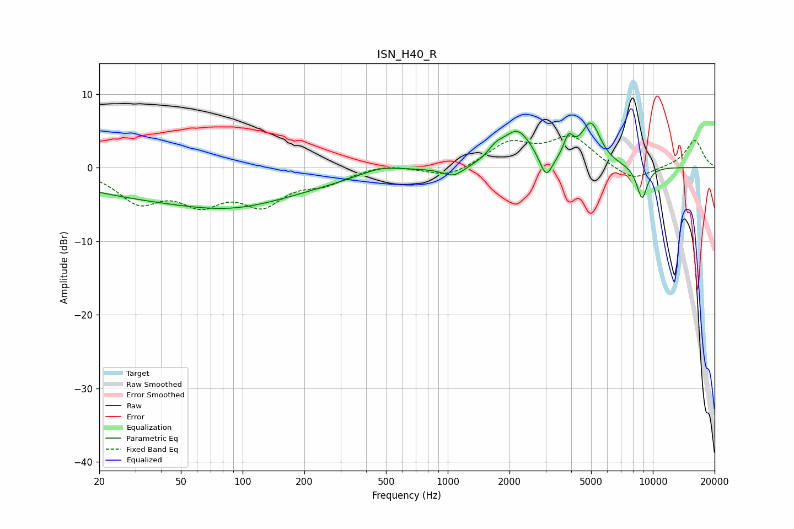

# ISN_H40_R
See [usage instructions](https://github.com/jaakkopasanen/AutoEq#usage) for more options and info.

### Parametric EQs
Apply preamp of -6.2 dB when using parametric equalizer.

|   # | Type    |   Fc (Hz) |    Q |   Gain (dB) |
|-----|---------|-----------|------|-------------|
|   1 | Peaking |        60 | 0.23 |        -4.3 |
|   2 | Peaking |        88 | 0.62 |        -1.3 |
|   3 | Peaking |       471 | 1.39 |         1   |
|   4 | Peaking |      1068 | 2.62 |        -1.4 |
|   5 | Peaking |      1716 | 3.77 |         1.2 |
|   6 | Peaking |      2187 | 1.94 |         4.9 |
|   7 | Peaking |      3020 | 4.55 |        -3.2 |
|   8 | Peaking |      3882 | 5.98 |         2.7 |
|   9 | Peaking |      4986 | 2.91 |         5.7 |
|  10 | Peaking |      8855 | 4.85 |        -4.5 |

### Fixed Band EQs
When using fixed band (also called graphic) equalizer, apply preamp of **-4.4 dB** (if available) and set gains manually with these parameters.

|   # | Type    |   Fc (Hz) |    Q |   Gain (dB) |
|-----|---------|-----------|------|-------------|
|   1 | Peaking |        31 | 1.41 |        -4.2 |
|   2 | Peaking |        62 | 1.41 |        -4.1 |
|   3 | Peaking |       125 | 1.41 |        -4.4 |
|   4 | Peaking |       250 | 1.41 |        -1.8 |
|   5 | Peaking |       500 | 1.41 |         0.6 |
|   6 | Peaking |      1000 | 1.41 |        -1.4 |
|   7 | Peaking |      2000 | 1.41 |         3.2 |
|   8 | Peaking |      4000 | 1.41 |         4   |
|   9 | Peaking |      8000 | 1.41 |        -2   |
|  10 | Peaking |     16000 | 1.41 |         3.8 |

### Graphs

