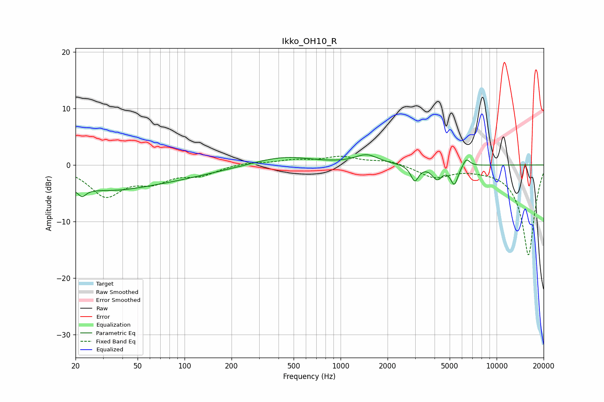

# Ikko_OH10_R
See [usage instructions](https://github.com/jaakkopasanen/AutoEq#usage) for more options and info.

### Parametric EQs
Apply preamp of -1.9 dB when using parametric equalizer.

|   # | Type    |   Fc (Hz) |    Q |   Gain (dB) |
|-----|---------|-----------|------|-------------|
|   1 | Peaking |        22 | 5.84 |        -4.3 |
|   2 | Peaking |        22 | 6    |         3   |
|   3 | Peaking |        25 | 0.19 |        -3.9 |
|   4 | Peaking |        37 | 0.89 |        -0.6 |
|   5 | Peaking |       430 | 0.76 |         1.6 |
|   6 | Peaking |      1468 | 1.93 |         1.7 |
|   7 | Peaking |      2987 | 5.73 |        -2.8 |
|   8 | Peaking |      4153 | 4.42 |        -2.3 |
|   9 | Peaking |      5359 | 5.8  |        -3.3 |
|  10 | Peaking |      6392 | 6    |         1.5 |

### Fixed Band EQs
When using fixed band (also called graphic) equalizer, apply preamp of **-1.6 dB** (if available) and set gains manually with these parameters.

|   # | Type    |   Fc (Hz) |    Q |   Gain (dB) |
|-----|---------|-----------|------|-------------|
|   1 | Peaking |        31 | 1.41 |        -5.2 |
|   2 | Peaking |        62 | 1.41 |        -2.5 |
|   3 | Peaking |       125 | 1.41 |        -1.6 |
|   4 | Peaking |       250 | 1.41 |         0.5 |
|   5 | Peaking |       500 | 1.41 |         0.7 |
|   6 | Peaking |      1000 | 1.41 |         1.3 |
|   7 | Peaking |      2000 | 1.41 |         0.8 |
|   8 | Peaking |      4000 | 1.41 |        -2.1 |
|   9 | Peaking |      8000 | 1.41 |        -0.3 |
|  10 | Peaking |     16000 | 1.41 |       -16   |

### Graphs

