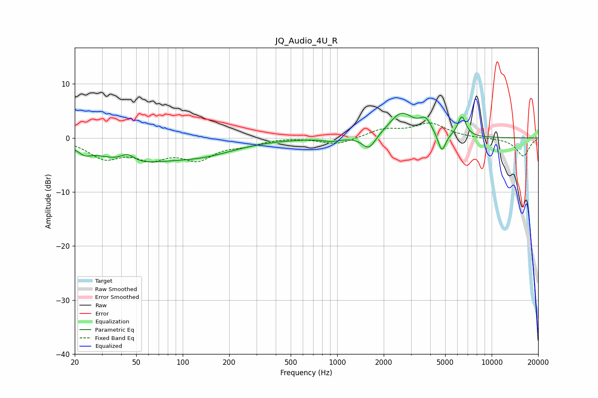

# JQ_Audio_4U_R
See [usage instructions](https://github.com/jaakkopasanen/AutoEq#usage) for more options and info.

### Parametric EQs
Apply preamp of -4.7 dB when using parametric equalizer.

|   # | Type    |   Fc (Hz) |    Q |   Gain (dB) |
|-----|---------|-----------|------|-------------|
|   1 | Peaking |        23 | 3.71 |        -1   |
|   2 | Peaking |        44 | 3.24 |         1.6 |
|   3 | Peaking |        46 | 0.61 |        -4   |
|   4 | Peaking |       134 | 0.63 |        -2.5 |
|   5 | Peaking |       919 | 2.64 |        -0.6 |
|   6 | Peaking |      1604 | 3.22 |        -2.7 |
|   7 | Peaking |      2603 | 1.74 |         4.6 |
|   8 | Peaking |      3736 | 3.73 |         2.4 |
|   9 | Peaking |      4756 | 5.74 |        -3.6 |
|  10 | Peaking |      6409 | 5.16 |         3.8 |

### Fixed Band EQs
When using fixed band (also called graphic) equalizer, apply preamp of **-2.9 dB** (if available) and set gains manually with these parameters.

|   # | Type    |   Fc (Hz) |    Q |   Gain (dB) |
|-----|---------|-----------|------|-------------|
|   1 | Peaking |        31 | 1.41 |        -3.4 |
|   2 | Peaking |        62 | 1.41 |        -3.1 |
|   3 | Peaking |       125 | 1.41 |        -3.5 |
|   4 | Peaking |       250 | 1.41 |        -1   |
|   5 | Peaking |       500 | 1.41 |         0.2 |
|   6 | Peaking |      1000 | 1.41 |        -1.3 |
|   7 | Peaking |      2000 | 1.41 |         1.5 |
|   8 | Peaking |      4000 | 1.41 |         2.6 |
|   9 | Peaking |      8000 | 1.41 |        -0.1 |
|  10 | Peaking |     16000 | 1.41 |        -3.4 |

### Graphs

