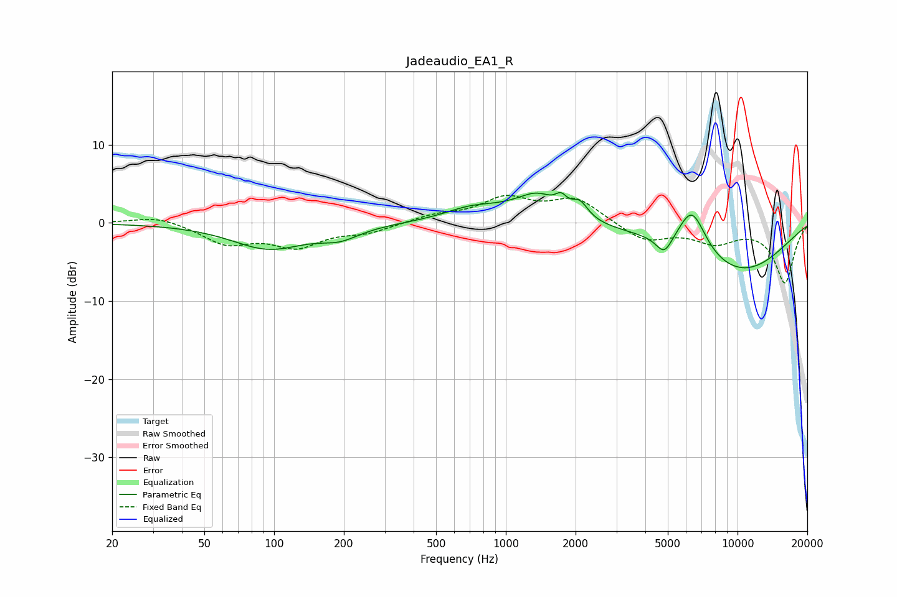

# Jadeaudio_EA1_R
See [usage instructions](https://github.com/jaakkopasanen/AutoEq#usage) for more options and info.

### Parametric EQs
Apply preamp of -4.0 dB when using parametric equalizer.

|   # | Type    |   Fc (Hz) |    Q |   Gain (dB) |
|-----|---------|-----------|------|-------------|
|   1 | Peaking |        95 | 0.89 |        -3.2 |
|   2 | Peaking |       192 | 1.63 |        -1.4 |
|   3 | Peaking |       721 | 1.14 |         1.8 |
|   4 | Peaking |      1031 | 1.76 |         0.4 |
|   5 | Peaking |      1369 | 1.63 |         3.1 |
|   6 | Peaking |      1731 | 5.89 |         1.4 |
|   7 | Peaking |      2084 | 3.9  |         2.1 |
|   8 | Peaking |      4829 | 3.93 |        -2.4 |
|   9 | Peaking |      6361 | 2.27 |         5.8 |
|  10 | Peaking |      9955 | 0.5  |        -6.3 |

### Fixed Band EQs
When using fixed band (also called graphic) equalizer, apply preamp of **-3.6 dB** (if available) and set gains manually with these parameters.

|   # | Type    |   Fc (Hz) |    Q |   Gain (dB) |
|-----|---------|-----------|------|-------------|
|   1 | Peaking |        31 | 1.41 |         0.9 |
|   2 | Peaking |        62 | 1.41 |        -2.5 |
|   3 | Peaking |       125 | 1.41 |        -2.8 |
|   4 | Peaking |       250 | 1.41 |        -1.1 |
|   5 | Peaking |       500 | 1.41 |         0.9 |
|   6 | Peaking |      1000 | 1.41 |         3   |
|   7 | Peaking |      2000 | 1.41 |         3   |
|   8 | Peaking |      4000 | 1.41 |        -2.3 |
|   9 | Peaking |      8000 | 1.41 |        -2.3 |
|  10 | Peaking |     16000 | 1.41 |        -7.6 |

### Graphs

