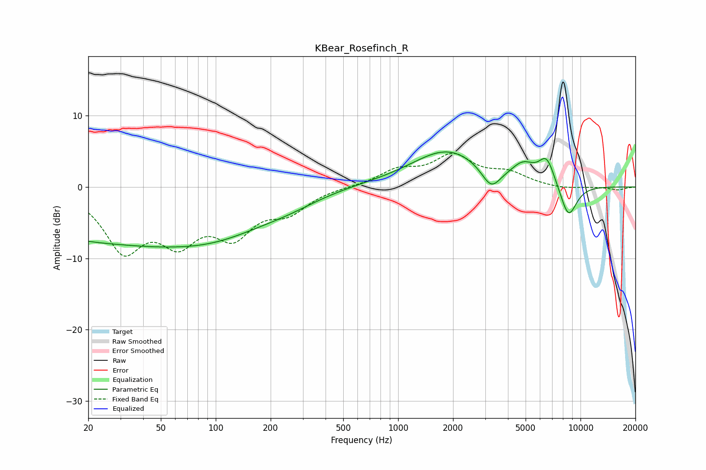

# KBear_Rosefinch_R
See [usage instructions](https://github.com/jaakkopasanen/AutoEq#usage) for more options and info.

### Parametric EQs
Apply preamp of -5.0 dB when using parametric equalizer.

|   # | Type    |   Fc (Hz) |    Q |   Gain (dB) |
|-----|---------|-----------|------|-------------|
|   1 | Peaking |        23 | 0.26 |        -7.1 |
|   2 | Peaking |        30 | 1.06 |         0.1 |
|   3 | Peaking |       109 | 0.47 |        -4.3 |
|   4 | Peaking |       249 | 0.9  |        -0.9 |
|   5 | Peaking |       579 | 0.88 |         0.2 |
|   6 | Peaking |      1869 | 0.7  |         5.2 |
|   7 | Peaking |      3237 | 2.64 |        -3.1 |
|   8 | Peaking |      4846 | 2.24 |         2.2 |
|   9 | Peaking |      6529 | 3.02 |         3.7 |
|  10 | Peaking |      8586 | 2.76 |        -4.8 |

### Fixed Band EQs
When using fixed band (also called graphic) equalizer, apply preamp of **-4.8 dB** (if available) and set gains manually with these parameters.

|   # | Type    |   Fc (Hz) |    Q |   Gain (dB) |
|-----|---------|-----------|------|-------------|
|   1 | Peaking |        31 | 1.41 |        -8.2 |
|   2 | Peaking |        62 | 1.41 |        -6.3 |
|   3 | Peaking |       125 | 1.41 |        -5.8 |
|   4 | Peaking |       250 | 1.41 |        -3   |
|   5 | Peaking |       500 | 1.41 |         0   |
|   6 | Peaking |      1000 | 1.41 |         2.1 |
|   7 | Peaking |      2000 | 1.41 |         4.1 |
|   8 | Peaking |      4000 | 1.41 |         1.7 |
|   9 | Peaking |      8000 | 1.41 |        -0.3 |
|  10 | Peaking |     16000 | 1.41 |        -0.4 |

### Graphs

