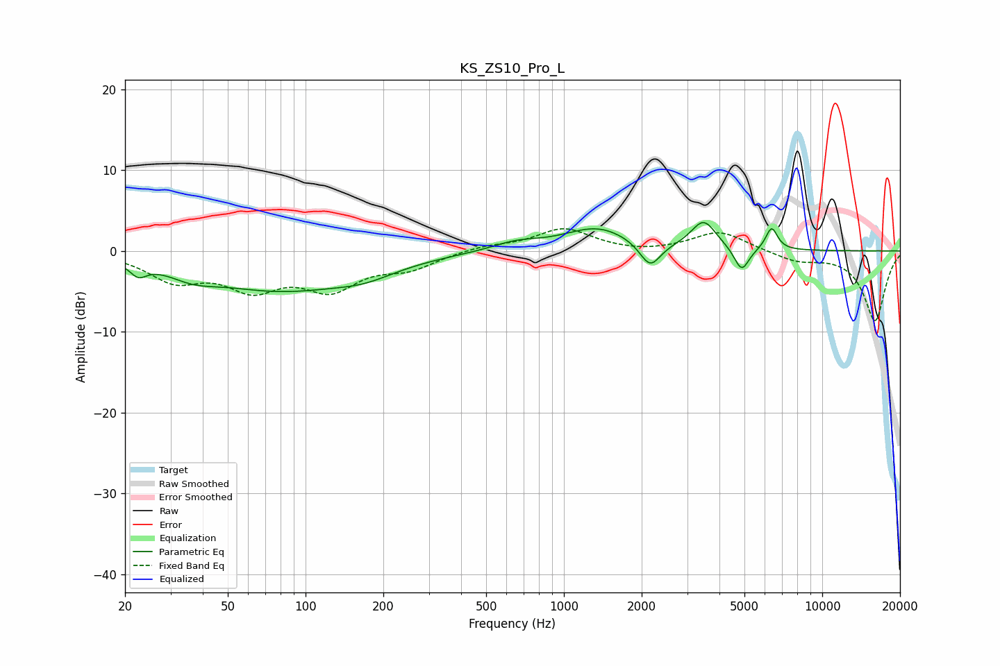

# KS_ZS10_Pro_L
See [usage instructions](https://github.com/jaakkopasanen/AutoEq#usage) for more options and info.

### Parametric EQs
Apply preamp of -3.6 dB when using parametric equalizer.

|   # | Type    |   Fc (Hz) |    Q |   Gain (dB) |
|-----|---------|-----------|------|-------------|
|   1 | Peaking |        22 | 4.41 |        -1.5 |
|   2 | Peaking |        37 | 1.56 |        -1.3 |
|   3 | Peaking |        80 | 0.48 |        -4.6 |
|   4 | Peaking |       169 | 1.19 |        -1.2 |
|   5 | Peaking |       653 | 1.5  |         1   |
|   6 | Peaking |      1346 | 1.09 |         2.8 |
|   7 | Peaking |      2158 | 3.48 |        -3.2 |
|   8 | Peaking |      3476 | 2.9  |         3.5 |
|   9 | Peaking |      4875 | 4.86 |        -3   |
|  10 | Peaking |      6368 | 6    |         2.8 |

### Fixed Band EQs
When using fixed band (also called graphic) equalizer, apply preamp of **-2.8 dB** (if available) and set gains manually with these parameters.

|   # | Type    |   Fc (Hz) |    Q |   Gain (dB) |
|-----|---------|-----------|------|-------------|
|   1 | Peaking |        31 | 1.41 |        -3.3 |
|   2 | Peaking |        62 | 1.41 |        -4   |
|   3 | Peaking |       125 | 1.41 |        -4.2 |
|   4 | Peaking |       250 | 1.41 |        -1.9 |
|   5 | Peaking |       500 | 1.41 |         0.6 |
|   6 | Peaking |      1000 | 1.41 |         2.7 |
|   7 | Peaking |      2000 | 1.41 |        -0.3 |
|   8 | Peaking |      4000 | 1.41 |         2.5 |
|   9 | Peaking |      8000 | 1.41 |        -1.2 |
|  10 | Peaking |     16000 | 1.41 |        -8.6 |

### Graphs

