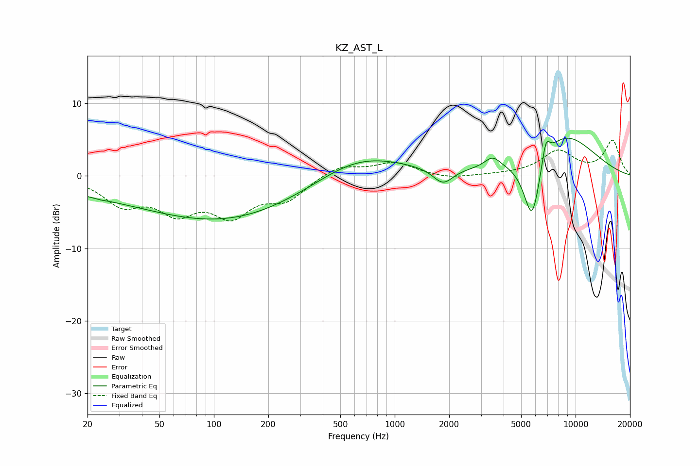

# KZ_AST_L
See [usage instructions](https://github.com/jaakkopasanen/AutoEq#usage) for more options and info.

### Parametric EQs
Apply preamp of -5.3 dB when using parametric equalizer.

|   # | Type    |   Fc (Hz) |    Q |   Gain (dB) |
|-----|---------|-----------|------|-------------|
|   1 | Peaking |        20 | 0.5  |        -1.3 |
|   2 | Peaking |        24 | 5.17 |        -0.1 |
|   3 | Peaking |       116 | 0.31 |        -6.1 |
|   4 | Peaking |       410 | 0.67 |        -0.8 |
|   5 | Peaking |       578 | 0.54 |         4.2 |
|   6 | Peaking |      1849 | 2.58 |        -2.2 |
|   7 | Peaking |      3476 | 3.23 |         1.5 |
|   8 | Peaking |      5752 | 2.77 |        -9.7 |
|   9 | Peaking |      6845 | 6    |         3.2 |
|  10 | Peaking |      8350 | 0.68 |         6.1 |

### Fixed Band EQs
When using fixed band (also called graphic) equalizer, apply preamp of **-5.0 dB** (if available) and set gains manually with these parameters.

|   # | Type    |   Fc (Hz) |    Q |   Gain (dB) |
|-----|---------|-----------|------|-------------|
|   1 | Peaking |        31 | 1.41 |        -3.6 |
|   2 | Peaking |        62 | 1.41 |        -4.3 |
|   3 | Peaking |       125 | 1.41 |        -4.8 |
|   4 | Peaking |       250 | 1.41 |        -2.9 |
|   5 | Peaking |       500 | 1.41 |         1.5 |
|   6 | Peaking |      1000 | 1.41 |         1.8 |
|   7 | Peaking |      2000 | 1.41 |        -0.5 |
|   8 | Peaking |      4000 | 1.41 |         0.1 |
|   9 | Peaking |      8000 | 1.41 |         3.3 |
|  10 | Peaking |     16000 | 1.41 |         4.8 |

### Graphs

