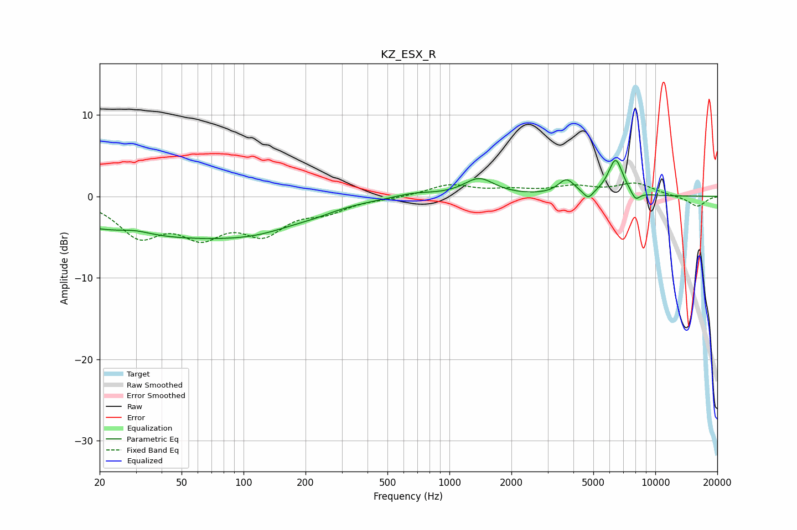

# KZ_ESX_R
See [usage instructions](https://github.com/jaakkopasanen/AutoEq#usage) for more options and info.

### Parametric EQs
Apply preamp of -4.5 dB when using parametric equalizer.

|   # | Type    |   Fc (Hz) |    Q |   Gain (dB) |
|-----|---------|-----------|------|-------------|
|   1 | Peaking |        30 | 1.75 |         0.6 |
|   2 | Peaking |        38 | 0.28 |        -4.7 |
|   3 | Peaking |       123 | 0.65 |        -1.8 |
|   4 | Peaking |       223 | 1.5  |        -0.4 |
|   5 | Peaking |       674 | 1.47 |         0.5 |
|   6 | Peaking |      1393 | 1.91 |         2.1 |
|   7 | Peaking |      3701 | 3.54 |         1.8 |
|   8 | Peaking |      4726 | 6    |        -1.1 |
|   9 | Peaking |      6413 | 3.78 |         4.5 |
|  10 | Peaking |      8010 | 5.99 |        -1.1 |

### Fixed Band EQs
When using fixed band (also called graphic) equalizer, apply preamp of **-1.7 dB** (if available) and set gains manually with these parameters.

|   # | Type    |   Fc (Hz) |    Q |   Gain (dB) |
|-----|---------|-----------|------|-------------|
|   1 | Peaking |        31 | 1.41 |        -4.4 |
|   2 | Peaking |        62 | 1.41 |        -4.1 |
|   3 | Peaking |       125 | 1.41 |        -4   |
|   4 | Peaking |       250 | 1.41 |        -1.5 |
|   5 | Peaking |       500 | 1.41 |        -0.2 |
|   6 | Peaking |      1000 | 1.41 |         1.4 |
|   7 | Peaking |      2000 | 1.41 |         0.6 |
|   8 | Peaking |      4000 | 1.41 |         1.1 |
|   9 | Peaking |      8000 | 1.41 |         1.5 |
|  10 | Peaking |     16000 | 1.41 |        -1.3 |

### Graphs

