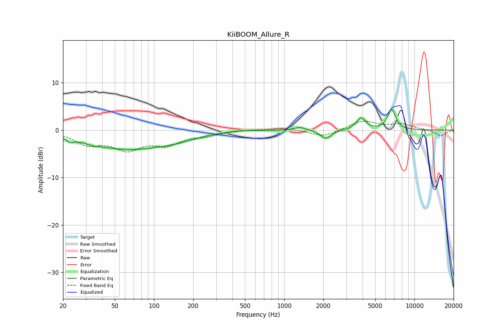

# KiiBOOM_Allure_R
See [usage instructions](https://github.com/jaakkopasanen/AutoEq#usage) for more options and info.

### Parametric EQs
Apply preamp of -4.4 dB when using parametric equalizer.

|   # | Type    |   Fc (Hz) |    Q |   Gain (dB) |
|-----|---------|-----------|------|-------------|
|   1 | Peaking |        23 | 4.96 |        -1.1 |
|   2 | Peaking |        34 | 1.46 |        -1.1 |
|   3 | Peaking |        72 | 0.57 |        -4.1 |
|   4 | Peaking |        84 | 1.51 |         0.4 |
|   5 | Peaking |       156 | 0.98 |        -0.7 |
|   6 | Peaking |       463 | 1.7  |         0.2 |
|   7 | Peaking |      1322 | 3.19 |         0.7 |
|   8 | Peaking |      2090 | 3.48 |        -1.8 |
|   9 | Peaking |      3892 | 4.12 |         2.5 |
|  10 | Peaking |      6675 | 4.49 |         4.3 |

### Fixed Band EQs
When using fixed band (also called graphic) equalizer, apply preamp of **-2.0 dB** (if available) and set gains manually with these parameters.

|   # | Type    |   Fc (Hz) |    Q |   Gain (dB) |
|-----|---------|-----------|------|-------------|
|   1 | Peaking |        31 | 1.41 |        -2.7 |
|   2 | Peaking |        62 | 1.41 |        -3.6 |
|   3 | Peaking |       125 | 1.41 |        -2.6 |
|   4 | Peaking |       250 | 1.41 |        -0.9 |
|   5 | Peaking |       500 | 1.41 |         0.1 |
|   6 | Peaking |      1000 | 1.41 |         0.5 |
|   7 | Peaking |      2000 | 1.41 |        -1.5 |
|   8 | Peaking |      4000 | 1.41 |         1.9 |
|   9 | Peaking |      8000 | 1.41 |         1.2 |
|  10 | Peaking |     16000 | 1.41 |        -1.2 |

### Graphs

