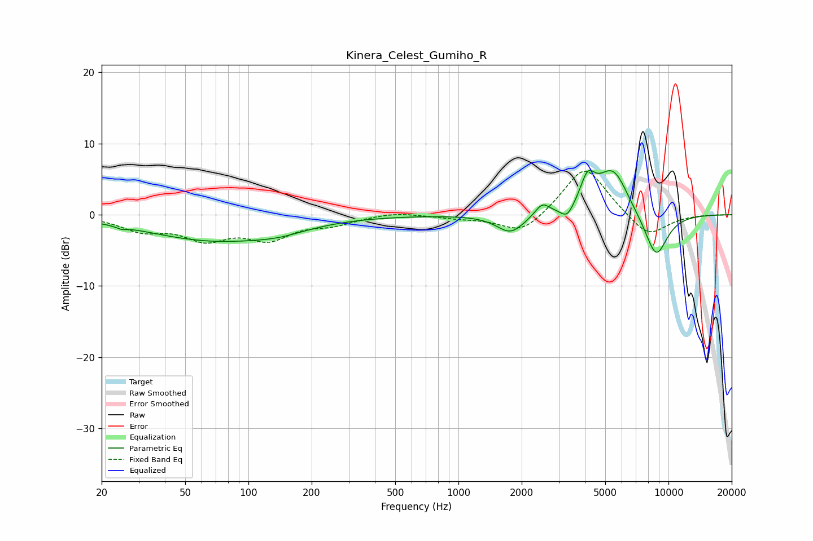

# Kinera_Celest_Gumiho_R
See [usage instructions](https://github.com/jaakkopasanen/AutoEq#usage) for more options and info.

### Parametric EQs
Apply preamp of -6.3 dB when using parametric equalizer.

|   # | Type    |   Fc (Hz) |    Q |   Gain (dB) |
|-----|---------|-----------|------|-------------|
|   1 | Peaking |        25 | 5.77 |        -0.4 |
|   2 | Peaking |        69 | 0.44 |        -3.5 |
|   3 | Peaking |       140 | 1.11 |        -0.8 |
|   4 | Peaking |      1772 | 2.14 |        -2.6 |
|   5 | Peaking |      2507 | 4.12 |         1.7 |
|   6 | Peaking |      3296 | 4.62 |        -1.7 |
|   7 | Peaking |      4124 | 4.01 |         3.9 |
|   8 | Peaking |      5357 | 1.85 |         5.7 |
|   9 | Peaking |      5798 | 2.59 |         0.8 |
|  10 | Peaking |      8724 | 2.3  |        -6.4 |

### Fixed Band EQs
When using fixed band (also called graphic) equalizer, apply preamp of **-6.2 dB** (if available) and set gains manually with these parameters.

|   # | Type    |   Fc (Hz) |    Q |   Gain (dB) |
|-----|---------|-----------|------|-------------|
|   1 | Peaking |        31 | 1.41 |        -2   |
|   2 | Peaking |        62 | 1.41 |        -3   |
|   3 | Peaking |       125 | 1.41 |        -3   |
|   4 | Peaking |       250 | 1.41 |        -1.1 |
|   5 | Peaking |       500 | 1.41 |         0.5 |
|   6 | Peaking |      1000 | 1.41 |        -0.4 |
|   7 | Peaking |      2000 | 1.41 |        -2.9 |
|   8 | Peaking |      4000 | 1.41 |         7.1 |
|   9 | Peaking |      8000 | 1.41 |        -3.3 |
|  10 | Peaking |     16000 | 1.41 |         0   |

### Graphs

