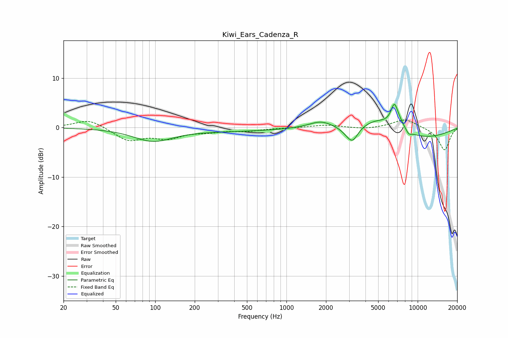

# Kiwi_Ears_Cadenza_R
See [usage instructions](https://github.com/jaakkopasanen/AutoEq#usage) for more options and info.

### Parametric EQs
Apply preamp of -4.8 dB when using parametric equalizer.

|   # | Type    |   Fc (Hz) |    Q |   Gain (dB) |
|-----|---------|-----------|------|-------------|
|   1 | Peaking |        96 | 0.96 |        -2.5 |
|   2 | Peaking |       372 | 0.35 |        -0.7 |
|   3 | Peaking |      1829 | 1.54 |         1.5 |
|   4 | Peaking |      2905 | 2.71 |        -0.8 |
|   5 | Peaking |      3191 | 3.39 |        -2.7 |
|   6 | Peaking |      4942 | 1.09 |         2.4 |
|   7 | Peaking |      6634 | 4.92 |         3.9 |
|   8 | Peaking |      7193 | 2.82 |         1.5 |
|   9 | Peaking |      8537 | 6    |        -0.8 |
|  10 | Peaking |     10000 | 0.43 |        -2.2 |

### Fixed Band EQs
When using fixed band (also called graphic) equalizer, apply preamp of **-1.6 dB** (if available) and set gains manually with these parameters.

|   # | Type    |   Fc (Hz) |    Q |   Gain (dB) |
|-----|---------|-----------|------|-------------|
|   1 | Peaking |        31 | 1.41 |         1.8 |
|   2 | Peaking |        62 | 1.41 |        -2.5 |
|   3 | Peaking |       125 | 1.41 |        -1.9 |
|   4 | Peaking |       250 | 1.41 |        -0.7 |
|   5 | Peaking |       500 | 1.41 |        -0.6 |
|   6 | Peaking |      1000 | 1.41 |        -0   |
|   7 | Peaking |      2000 | 1.41 |         0.5 |
|   8 | Peaking |      4000 | 1.41 |        -0.3 |
|   9 | Peaking |      8000 | 1.41 |         1.8 |
|  10 | Peaking |     16000 | 1.41 |        -4.6 |

### Graphs

