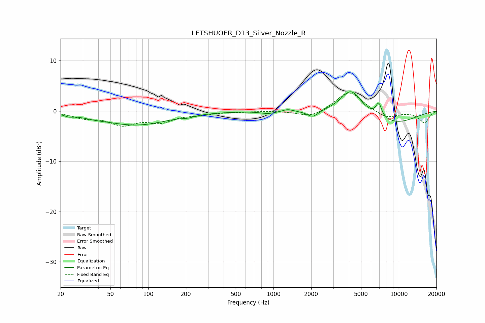

# LETSHUOER_D13_Silver_Nozzle_R
See [usage instructions](https://github.com/jaakkopasanen/AutoEq#usage) for more options and info.

### Parametric EQs
Apply preamp of -3.9 dB when using parametric equalizer.

|   # | Type    |   Fc (Hz) |    Q |   Gain (dB) |
|-----|---------|-----------|------|-------------|
|   1 | Peaking |        23 | 4.08 |        -0.4 |
|   2 | Peaking |        37 | 1.55 |        -0.4 |
|   3 | Peaking |        80 | 0.55 |        -2.8 |
|   4 | Peaking |       208 | 3.18 |        -0.3 |
|   5 | Peaking |       905 | 2.43 |        -0.5 |
|   6 | Peaking |      1301 | 3.93 |         0.4 |
|   7 | Peaking |      2057 | 3.09 |        -1.4 |
|   8 | Peaking |      4152 | 1.71 |         4.6 |
|   9 | Peaking |      6923 | 5.95 |         2.6 |
|  10 | Peaking |      9219 | 0.67 |        -2.4 |

### Fixed Band EQs
When using fixed band (also called graphic) equalizer, apply preamp of **-3.7 dB** (if available) and set gains manually with these parameters.

|   # | Type    |   Fc (Hz) |    Q |   Gain (dB) |
|-----|---------|-----------|------|-------------|
|   1 | Peaking |        31 | 1.41 |        -1.2 |
|   2 | Peaking |        62 | 1.41 |        -2.5 |
|   3 | Peaking |       125 | 1.41 |        -1.9 |
|   4 | Peaking |       250 | 1.41 |        -0.6 |
|   5 | Peaking |       500 | 1.41 |        -0.1 |
|   6 | Peaking |      1000 | 1.41 |         0   |
|   7 | Peaking |      2000 | 1.41 |        -1.4 |
|   8 | Peaking |      4000 | 1.41 |         4   |
|   9 | Peaking |      8000 | 1.41 |        -1.5 |
|  10 | Peaking |     16000 | 1.41 |        -2.3 |

### Graphs

