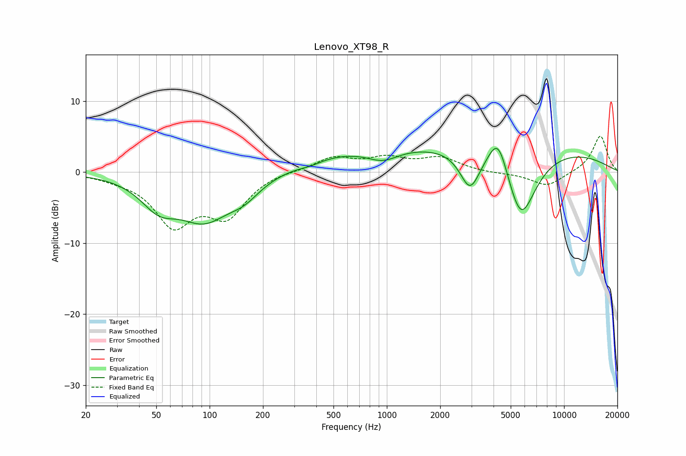

# Lenovo_XT98_R
See [usage instructions](https://github.com/jaakkopasanen/AutoEq#usage) for more options and info.

### Parametric EQs
Apply preamp of -3.4 dB when using parametric equalizer.

|   # | Type    |   Fc (Hz) |    Q |   Gain (dB) |
|-----|---------|-----------|------|-------------|
|   1 | Peaking |        52 | 1.4  |        -3.6 |
|   2 | Peaking |        93 | 0.95 |        -6.1 |
|   3 | Peaking |       157 | 1.53 |        -2   |
|   4 | Peaking |       370 | 2.17 |        -0.5 |
|   5 | Peaking |       489 | 0.59 |         1.6 |
|   6 | Peaking |       949 | 1.65 |        -1.5 |
|   7 | Peaking |      2948 | 2.49 |        -5.4 |
|   8 | Peaking |      4164 | 0.18 |         4.3 |
|   9 | Peaking |      4247 | 2.53 |         5.3 |
|  10 | Peaking |      5696 | 1.54 |       -10.5 |

### Fixed Band EQs
When using fixed band (also called graphic) equalizer, apply preamp of **-5.1 dB** (if available) and set gains manually with these parameters.

|   # | Type    |   Fc (Hz) |    Q |   Gain (dB) |
|-----|---------|-----------|------|-------------|
|   1 | Peaking |        31 | 1.41 |        -0.5 |
|   2 | Peaking |        62 | 1.41 |        -7   |
|   3 | Peaking |       125 | 1.41 |        -5.6 |
|   4 | Peaking |       250 | 1.41 |         0.3 |
|   5 | Peaking |       500 | 1.41 |         2   |
|   6 | Peaking |      1000 | 1.41 |         1.7 |
|   7 | Peaking |      2000 | 1.41 |         1.9 |
|   8 | Peaking |      4000 | 1.41 |        -0.2 |
|   9 | Peaking |      8000 | 1.41 |        -2   |
|  10 | Peaking |     16000 | 1.41 |         5.2 |

### Graphs

