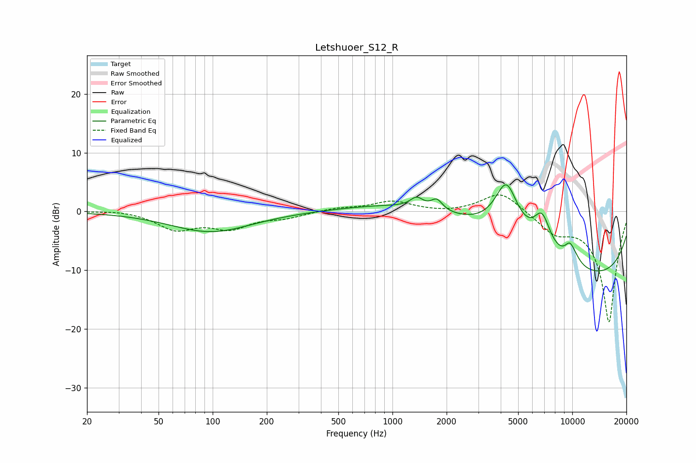

# Letshuoer_S12_R
See [usage instructions](https://github.com/jaakkopasanen/AutoEq#usage) for more options and info.

### Parametric EQs
Apply preamp of -4.6 dB when using parametric equalizer.

|   # | Type    |   Fc (Hz) |    Q |   Gain (dB) |
|-----|---------|-----------|------|-------------|
|   1 | Peaking |        98 | 0.64 |        -3.6 |
|   2 | Peaking |       102 | 0.87 |         0.2 |
|   3 | Peaking |      1363 | 4.04 |         1.7 |
|   4 | Peaking |      1764 | 4.56 |         1.8 |
|   5 | Peaking |      3217 | 0.25 |         4.8 |
|   6 | Peaking |      4301 | 2.08 |         9.3 |
|   7 | Peaking |      6792 | 2.84 |         5.7 |
|   8 | Peaking |      9878 | 3.83 |         4.9 |
|   9 | Peaking |     10000 | 0.2  |       -12.8 |
|  10 | Peaking |     10000 | 5.44 |        -1.7 |

### Fixed Band EQs
When using fixed band (also called graphic) equalizer, apply preamp of **-2.9 dB** (if available) and set gains manually with these parameters.

|   # | Type    |   Fc (Hz) |    Q |   Gain (dB) |
|-----|---------|-----------|------|-------------|
|   1 | Peaking |        31 | 1.41 |         0.3 |
|   2 | Peaking |        62 | 1.41 |        -2.9 |
|   3 | Peaking |       125 | 1.41 |        -2.6 |
|   4 | Peaking |       250 | 1.41 |        -0.9 |
|   5 | Peaking |       500 | 1.41 |         0.5 |
|   6 | Peaking |      1000 | 1.41 |         1.7 |
|   7 | Peaking |      2000 | 1.41 |        -0.3 |
|   8 | Peaking |      4000 | 1.41 |         3.5 |
|   9 | Peaking |      8000 | 1.41 |        -3   |
|  10 | Peaking |     16000 | 1.41 |       -18.9 |

### Graphs

