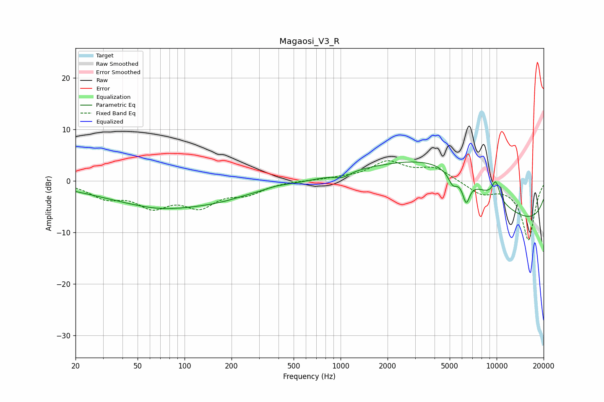

# Magaosi_V3_R
See [usage instructions](https://github.com/jaakkopasanen/AutoEq#usage) for more options and info.

### Parametric EQs
Apply preamp of -3.8 dB when using parametric equalizer.

|   # | Type    |   Fc (Hz) |    Q |   Gain (dB) |
|-----|---------|-----------|------|-------------|
|   1 | Peaking |        68 | 0.85 |        -0.7 |
|   2 | Peaking |        95 | 0.27 |        -4.8 |
|   3 | Peaking |       243 | 1.5  |         0.3 |
|   4 | Peaking |       382 | 1.42 |         0.7 |
|   5 | Peaking |      1026 | 2.97 |        -1   |
|   6 | Peaking |      4265 | 0.34 |        11.9 |
|   7 | Peaking |      5233 | 4.69 |        -2.4 |
|   8 | Peaking |      6384 | 5.78 |        -4.3 |
|   9 | Peaking |      9870 | 5.08 |         3.5 |
|  10 | Peaking |      9988 | 0.18 |       -10.7 |

### Fixed Band EQs
When using fixed band (also called graphic) equalizer, apply preamp of **-4.0 dB** (if available) and set gains manually with these parameters.

|   # | Type    |   Fc (Hz) |    Q |   Gain (dB) |
|-----|---------|-----------|------|-------------|
|   1 | Peaking |        31 | 1.41 |        -2.8 |
|   2 | Peaking |        62 | 1.41 |        -4.3 |
|   3 | Peaking |       125 | 1.41 |        -4.3 |
|   4 | Peaking |       250 | 1.41 |        -2.1 |
|   5 | Peaking |       500 | 1.41 |         0.1 |
|   6 | Peaking |      1000 | 1.41 |         0.4 |
|   7 | Peaking |      2000 | 1.41 |         3.6 |
|   8 | Peaking |      4000 | 1.41 |         2.4 |
|   9 | Peaking |      8000 | 1.41 |        -2.4 |
|  10 | Peaking |     16000 | 1.41 |       -11.4 |

### Graphs

