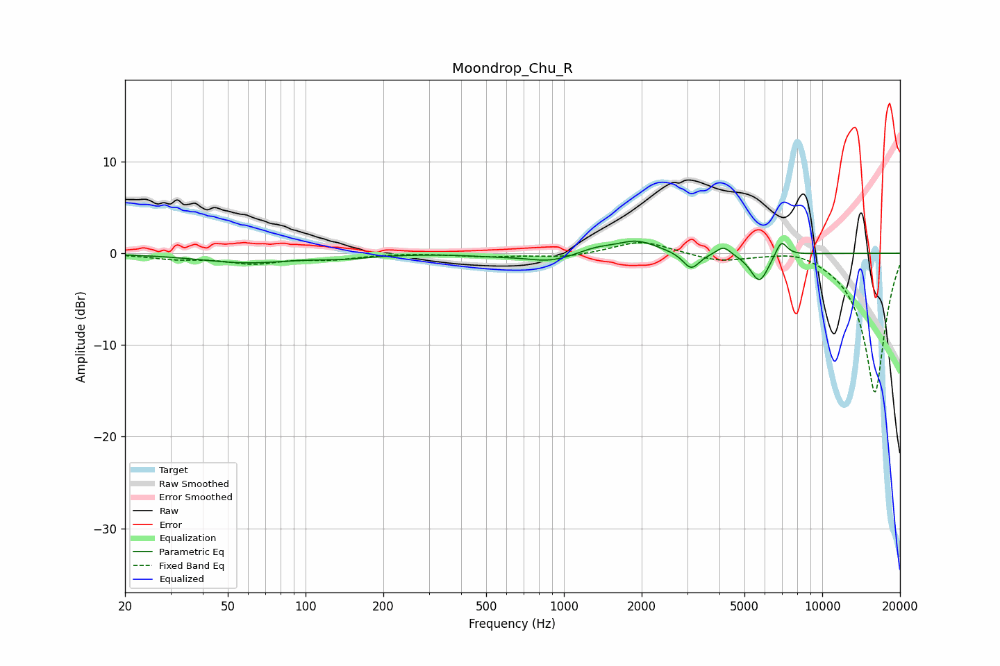

# Moondrop_Chu_R
See [usage instructions](https://github.com/jaakkopasanen/AutoEq#usage) for more options and info.

### Parametric EQs
Apply preamp of -1.4 dB when using parametric equalizer.

|   # | Type    |   Fc (Hz) |    Q |   Gain (dB) |
|-----|---------|-----------|------|-------------|
|   1 | Peaking |        59 | 0.79 |        -1   |
|   2 | Peaking |       140 | 1.36 |        -0.4 |
|   3 | Peaking |       528 | 1.34 |        -0.2 |
|   4 | Peaking |       884 | 1.55 |        -0.9 |
|   5 | Peaking |      1330 | 2.15 |         0.5 |
|   6 | Peaking |      1913 | 1.78 |         1.4 |
|   7 | Peaking |      3110 | 4.4  |        -1.8 |
|   8 | Peaking |      4148 | 5.11 |         1   |
|   9 | Peaking |      5714 | 3.95 |        -3.2 |
|  10 | Peaking |      6942 | 6    |         1.8 |

### Fixed Band EQs
When using fixed band (also called graphic) equalizer, apply preamp of **-1.2 dB** (if available) and set gains manually with these parameters.

|   # | Type    |   Fc (Hz) |    Q |   Gain (dB) |
|-----|---------|-----------|------|-------------|
|   1 | Peaking |        31 | 1.41 |        -0.5 |
|   2 | Peaking |        62 | 1.41 |        -1   |
|   3 | Peaking |       125 | 1.41 |        -0.6 |
|   4 | Peaking |       250 | 1.41 |         0.1 |
|   5 | Peaking |       500 | 1.41 |        -0.3 |
|   6 | Peaking |      1000 | 1.41 |        -0.5 |
|   7 | Peaking |      2000 | 1.41 |         1.4 |
|   8 | Peaking |      4000 | 1.41 |        -0.8 |
|   9 | Peaking |      8000 | 1.41 |         0.8 |
|  10 | Peaking |     16000 | 1.41 |       -15.3 |

### Graphs

