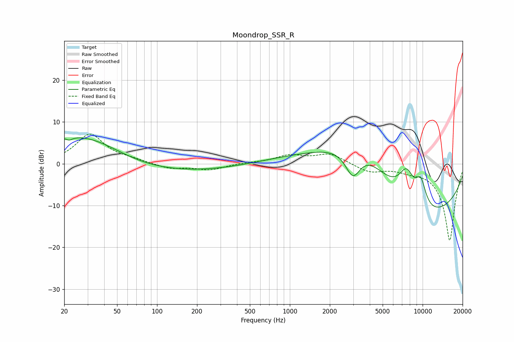

# Moondrop_SSR_R
See [usage instructions](https://github.com/jaakkopasanen/AutoEq#usage) for more options and info.

### Parametric EQs
Apply preamp of -6.3 dB when using parametric equalizer.

|   # | Type    |   Fc (Hz) |    Q |   Gain (dB) |
|-----|---------|-----------|------|-------------|
|   1 | Peaking |        21 | 4.76 |         1.1 |
|   2 | Peaking |        22 | 5.57 |        -1.5 |
|   3 | Peaking |        23 | 0.57 |         5.3 |
|   4 | Peaking |        38 | 0.64 |         2.3 |
|   5 | Peaking |       128 | 0.28 |        -2.1 |
|   6 | Peaking |      2988 | 2.25 |        -7.7 |
|   7 | Peaking |      3339 | 0.44 |        16.4 |
|   8 | Peaking |      7568 | 1.98 |         8.7 |
|   9 | Peaking |      8060 | 0.3  |       -20   |
|  10 | Peaking |      9678 | 3.03 |         6.4 |

### Fixed Band EQs
When using fixed band (also called graphic) equalizer, apply preamp of **-7.2 dB** (if available) and set gains manually with these parameters.

|   # | Type    |   Fc (Hz) |    Q |   Gain (dB) |
|-----|---------|-----------|------|-------------|
|   1 | Peaking |        31 | 1.41 |         7   |
|   2 | Peaking |        62 | 1.41 |         0.7 |
|   3 | Peaking |       125 | 1.41 |        -1.2 |
|   4 | Peaking |       250 | 1.41 |        -1.4 |
|   5 | Peaking |       500 | 1.41 |         0.2 |
|   6 | Peaking |      1000 | 1.41 |         1.9 |
|   7 | Peaking |      2000 | 1.41 |         2.4 |
|   8 | Peaking |      4000 | 1.41 |        -1.9 |
|   9 | Peaking |      8000 | 1.41 |        -1.1 |
|  10 | Peaking |     16000 | 1.41 |       -18.4 |

### Graphs

