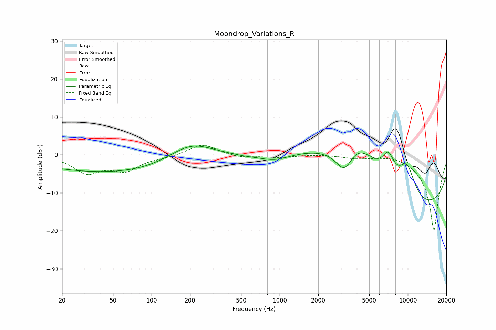

# Moondrop_Variations_R
See [usage instructions](https://github.com/jaakkopasanen/AutoEq#usage) for more options and info.

### Parametric EQs
Apply preamp of -2.4 dB when using parametric equalizer.

|   # | Type    |   Fc (Hz) |    Q |   Gain (dB) |
|-----|---------|-----------|------|-------------|
|   1 | Peaking |        60 | 0.2  |        -4.8 |
|   2 | Peaking |       126 | 0.44 |        -0.4 |
|   3 | Peaking |       202 | 0.74 |         6.1 |
|   4 | Peaking |       544 | 1.72 |        -0.3 |
|   5 | Peaking |       911 | 1.15 |        -2   |
|   6 | Peaking |      3219 | 1.73 |        -9.4 |
|   7 | Peaking |      3813 | 0.52 |        19.5 |
|   8 | Peaking |      7045 | 2.86 |         5.9 |
|   9 | Peaking |      9344 | 0.22 |       -19.9 |
|  10 | Peaking |      9838 | 1.74 |         9.4 |

### Fixed Band EQs
When using fixed band (also called graphic) equalizer, apply preamp of **-2.6 dB** (if available) and set gains manually with these parameters.

|   # | Type    |   Fc (Hz) |    Q |   Gain (dB) |
|-----|---------|-----------|------|-------------|
|   1 | Peaking |        31 | 1.41 |        -4.5 |
|   2 | Peaking |        62 | 1.41 |        -3.7 |
|   3 | Peaking |       125 | 1.41 |        -0.6 |
|   4 | Peaking |       250 | 1.41 |         2.9 |
|   5 | Peaking |       500 | 1.41 |        -0.8 |
|   6 | Peaking |      1000 | 1.41 |        -0.6 |
|   7 | Peaking |      2000 | 1.41 |         0.2 |
|   8 | Peaking |      4000 | 1.41 |        -0.8 |
|   9 | Peaking |      8000 | 1.41 |         0.6 |
|  10 | Peaking |     16000 | 1.41 |       -20   |

### Graphs

