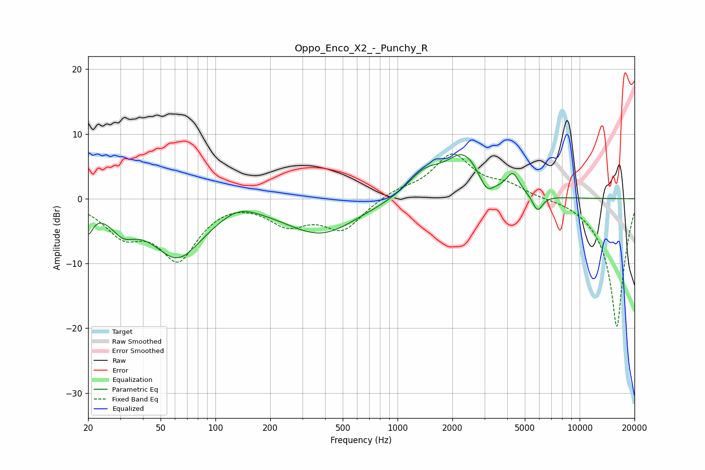

# Oppo_Enco_X2_-_Punchy_R
See [usage instructions](https://github.com/jaakkopasanen/AutoEq#usage) for more options and info.

### Parametric EQs
Apply preamp of -6.9 dB when using parametric equalizer.

|   # | Type    |   Fc (Hz) |    Q |   Gain (dB) |
|-----|---------|-----------|------|-------------|
|   1 | Peaking |        20 | 5.52 |        -3.6 |
|   2 | Peaking |        31 | 2.15 |        -3   |
|   3 | Peaking |        62 | 0.96 |        -8.8 |
|   4 | Peaking |       134 | 1.36 |         1.8 |
|   5 | Peaking |       381 | 0.71 |        -5.3 |
|   6 | Peaking |      1405 | 1.45 |         3.6 |
|   7 | Peaking |      2318 | 1.43 |         6.3 |
|   8 | Peaking |      3084 | 3.52 |        -2.5 |
|   9 | Peaking |      4301 | 4.06 |         3   |
|  10 | Peaking |      5870 | 5    |        -2.5 |

### Fixed Band EQs
When using fixed band (also called graphic) equalizer, apply preamp of **-7.0 dB** (if available) and set gains manually with these parameters.

|   # | Type    |   Fc (Hz) |    Q |   Gain (dB) |
|-----|---------|-----------|------|-------------|
|   1 | Peaking |        31 | 1.41 |        -4.8 |
|   2 | Peaking |        62 | 1.41 |        -8.8 |
|   3 | Peaking |       125 | 1.41 |         0.4 |
|   4 | Peaking |       250 | 1.41 |        -3.5 |
|   5 | Peaking |       500 | 1.41 |        -4.6 |
|   6 | Peaking |      1000 | 1.41 |         1.2 |
|   7 | Peaking |      2000 | 1.41 |         6.7 |
|   8 | Peaking |      4000 | 1.41 |         1.8 |
|   9 | Peaking |      8000 | 1.41 |         0.3 |
|  10 | Peaking |     16000 | 1.41 |       -20   |

### Graphs

