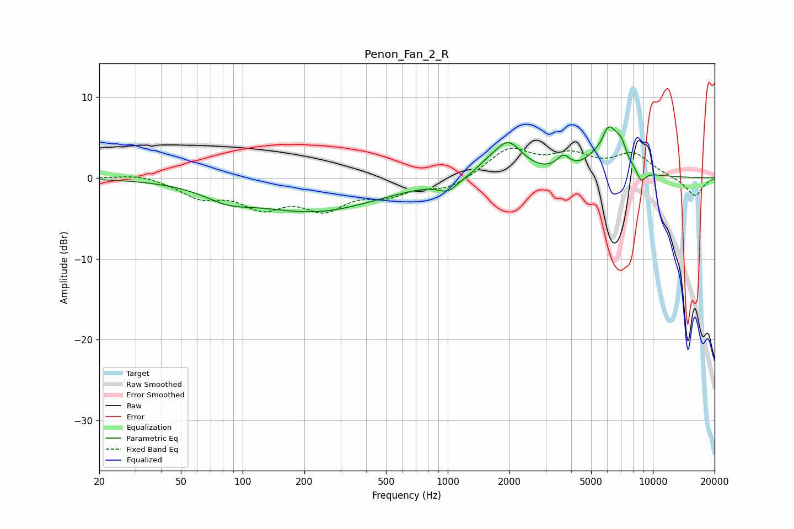

# Penon_Fan_2_R
See [usage instructions](https://github.com/jaakkopasanen/AutoEq#usage) for more options and info.

### Parametric EQs
Apply preamp of -6.4 dB when using parametric equalizer.

|   # | Type    |   Fc (Hz) |    Q |   Gain (dB) |
|-----|---------|-----------|------|-------------|
|   1 | Peaking |        84 | 1.26 |        -1.4 |
|   2 | Peaking |       224 | 0.45 |        -4   |
|   3 | Peaking |      1001 | 3.11 |        -1.3 |
|   4 | Peaking |      1523 | 3.22 |         0.6 |
|   5 | Peaking |      1959 | 1.96 |         4.4 |
|   6 | Peaking |      3660 | 4.51 |         1.6 |
|   7 | Peaking |      5581 | 6    |        -0.9 |
|   8 | Peaking |      6054 | 2.45 |         6.3 |
|   9 | Peaking |      7028 | 5.98 |         1.5 |
|  10 | Peaking |      8774 | 5.89 |        -1.5 |

### Fixed Band EQs
When using fixed band (also called graphic) equalizer, apply preamp of **-3.8 dB** (if available) and set gains manually with these parameters.

|   # | Type    |   Fc (Hz) |    Q |   Gain (dB) |
|-----|---------|-----------|------|-------------|
|   1 | Peaking |        31 | 1.41 |         0.6 |
|   2 | Peaking |        62 | 1.41 |        -2.1 |
|   3 | Peaking |       125 | 1.41 |        -3.1 |
|   4 | Peaking |       250 | 1.41 |        -3.4 |
|   5 | Peaking |       500 | 1.41 |        -1.8 |
|   6 | Peaking |      1000 | 1.41 |        -1.3 |
|   7 | Peaking |      2000 | 1.41 |         3.5 |
|   8 | Peaking |      4000 | 1.41 |         2.4 |
|   9 | Peaking |      8000 | 1.41 |         2.8 |
|  10 | Peaking |     16000 | 1.41 |        -2.3 |

### Graphs

