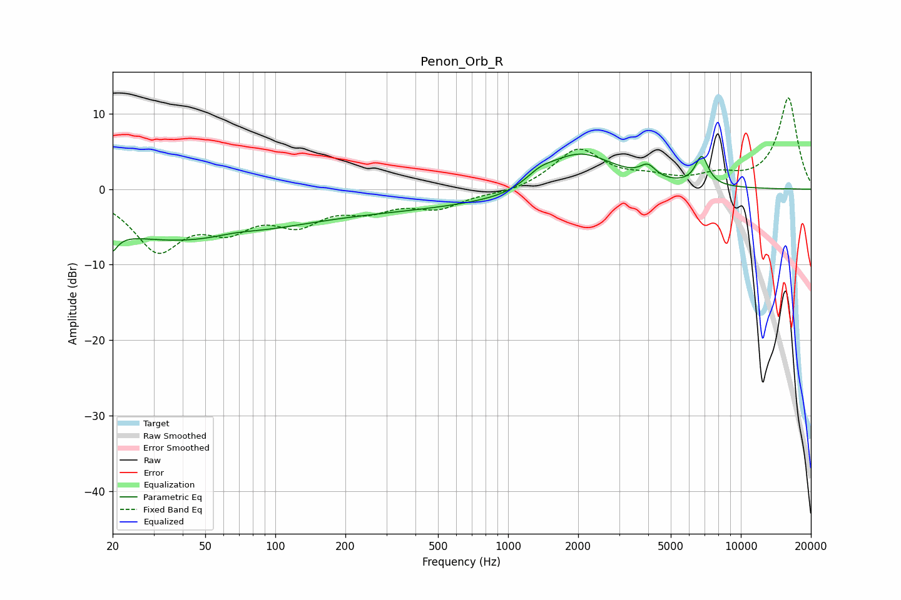

# Penon_Orb_R
See [usage instructions](https://github.com/jaakkopasanen/AutoEq#usage) for more options and info.

### Parametric EQs
Apply preamp of -4.7 dB when using parametric equalizer.

|   # | Type    |   Fc (Hz) |    Q |   Gain (dB) |
|-----|---------|-----------|------|-------------|
|   1 | Peaking |        20 | 5.42 |        -6.1 |
|   2 | Peaking |        20 | 5.74 |         3.4 |
|   3 | Peaking |        35 | 0.35 |        -6.2 |
|   4 | Peaking |        68 | 1.49 |         0.5 |
|   5 | Peaking |       264 | 0.25 |        -2.6 |
|   6 | Peaking |      1105 | 0.92 |        -0.9 |
|   7 | Peaking |      1362 | 2.28 |         1.3 |
|   8 | Peaking |      2005 | 0.91 |         5.3 |
|   9 | Peaking |      3984 | 4.24 |         1.6 |
|  10 | Peaking |      6798 | 4.8  |         3.8 |

### Fixed Band EQs
When using fixed band (also called graphic) equalizer, apply preamp of **-12.2 dB** (if available) and set gains manually with these parameters.

|   # | Type    |   Fc (Hz) |    Q |   Gain (dB) |
|-----|---------|-----------|------|-------------|
|   1 | Peaking |        31 | 1.41 |        -7.6 |
|   2 | Peaking |        62 | 1.41 |        -4.1 |
|   3 | Peaking |       125 | 1.41 |        -3.8 |
|   4 | Peaking |       250 | 1.41 |        -2.2 |
|   5 | Peaking |       500 | 1.41 |        -2.2 |
|   6 | Peaking |      1000 | 1.41 |        -0.6 |
|   7 | Peaking |      2000 | 1.41 |         5.2 |
|   8 | Peaking |      4000 | 1.41 |         1.1 |
|   9 | Peaking |      8000 | 1.41 |         1.5 |
|  10 | Peaking |     16000 | 1.41 |        12.1 |

### Graphs

