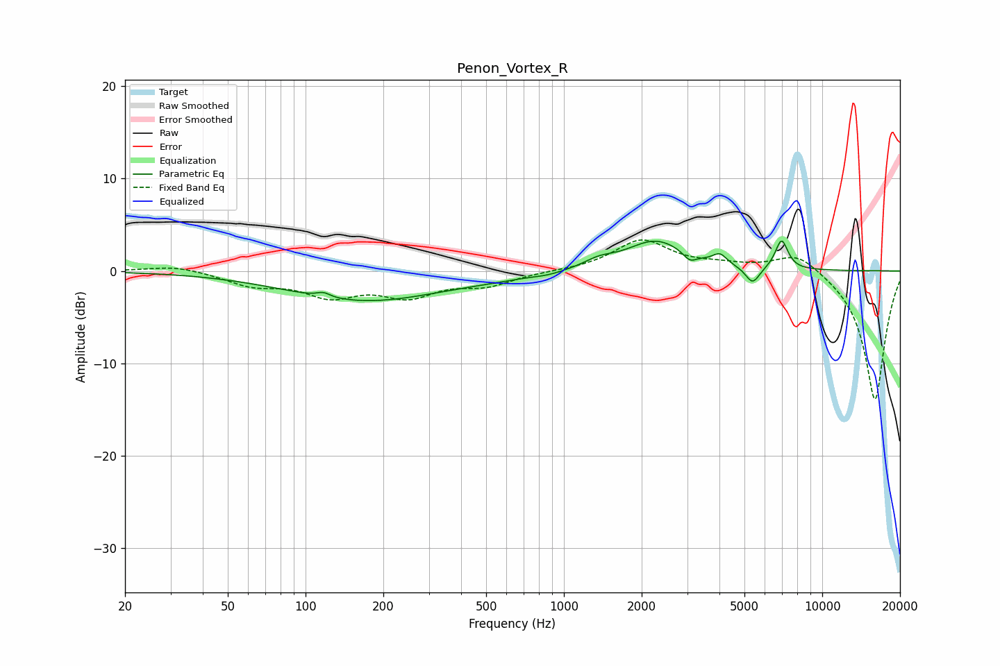

# Penon_Vortex_R
See [usage instructions](https://github.com/jaakkopasanen/AutoEq#usage) for more options and info.

### Parametric EQs
Apply preamp of -3.3 dB when using parametric equalizer.

|   # | Type    |   Fc (Hz) |    Q |   Gain (dB) |
|-----|---------|-----------|------|-------------|
|   1 | Peaking |       117 | 5.63 |         0.5 |
|   2 | Peaking |       170 | 0.48 |        -3.2 |
|   3 | Peaking |       541 | 0.85 |        -0.3 |
|   4 | Peaking |       867 | 2.63 |        -0.2 |
|   5 | Peaking |      1366 | 2.42 |         0.8 |
|   6 | Peaking |      2270 | 1.23 |         3.3 |
|   7 | Peaking |      3071 | 5.59 |        -0.9 |
|   8 | Peaking |      4014 | 5.2  |         1.1 |
|   9 | Peaking |      5377 | 4.99 |        -1.9 |
|  10 | Peaking |      6961 | 5.52 |         3.2 |

### Fixed Band EQs
When using fixed band (also called graphic) equalizer, apply preamp of **-3.5 dB** (if available) and set gains manually with these parameters.

|   # | Type    |   Fc (Hz) |    Q |   Gain (dB) |
|-----|---------|-----------|------|-------------|
|   1 | Peaking |        31 | 1.41 |         0.6 |
|   2 | Peaking |        62 | 1.41 |        -1.4 |
|   3 | Peaking |       125 | 1.41 |        -2.4 |
|   4 | Peaking |       250 | 1.41 |        -2.4 |
|   5 | Peaking |       500 | 1.41 |        -1.4 |
|   6 | Peaking |      1000 | 1.41 |         0   |
|   7 | Peaking |      2000 | 1.41 |         3.3 |
|   8 | Peaking |      4000 | 1.41 |         0.5 |
|   9 | Peaking |      8000 | 1.41 |         2.2 |
|  10 | Peaking |     16000 | 1.41 |       -14.1 |

### Graphs

