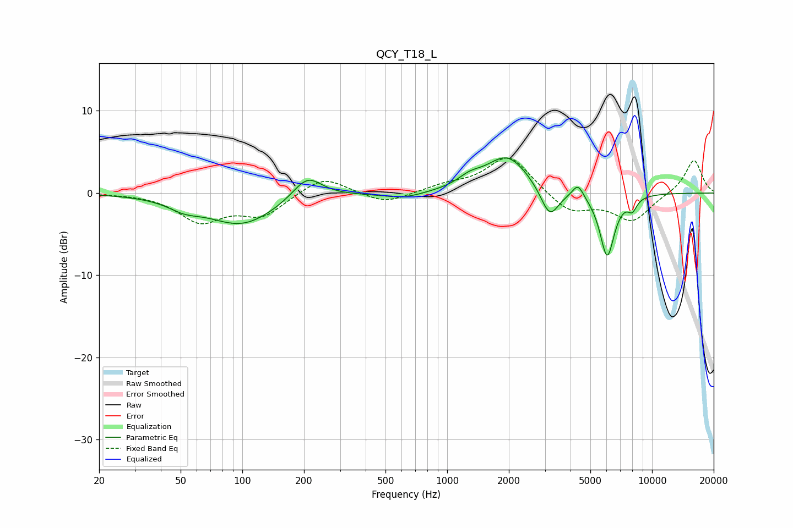

# QCY_T18_L
See [usage instructions](https://github.com/jaakkopasanen/AutoEq#usage) for more options and info.

### Parametric EQs
Apply preamp of -4.4 dB when using parametric equalizer.

|   # | Type    |   Fc (Hz) |    Q |   Gain (dB) |
|-----|---------|-----------|------|-------------|
|   1 | Peaking |        52 | 1.83 |        -1   |
|   2 | Peaking |        99 | 0.84 |        -3.8 |
|   3 | Peaking |       207 | 1.97 |         2.9 |
|   4 | Peaking |       613 | 1.47 |        -0.7 |
|   5 | Peaking |      1288 | 2.43 |         1   |
|   6 | Peaking |      1966 | 1.35 |         4.5 |
|   7 | Peaking |      3167 | 3.15 |        -3.7 |
|   8 | Peaking |      4351 | 5.17 |         1.7 |
|   9 | Peaking |      6040 | 3.81 |        -7.7 |
|  10 | Peaking |      8014 | 5.93 |        -1.4 |

### Fixed Band EQs
When using fixed band (also called graphic) equalizer, apply preamp of **-4.4 dB** (if available) and set gains manually with these parameters.

|   # | Type    |   Fc (Hz) |    Q |   Gain (dB) |
|-----|---------|-----------|------|-------------|
|   1 | Peaking |        31 | 1.41 |         0   |
|   2 | Peaking |        62 | 1.41 |        -3.3 |
|   3 | Peaking |       125 | 1.41 |        -2.6 |
|   4 | Peaking |       250 | 1.41 |         2.2 |
|   5 | Peaking |       500 | 1.41 |        -1.4 |
|   6 | Peaking |      1000 | 1.41 |         0.8 |
|   7 | Peaking |      2000 | 1.41 |         4.6 |
|   8 | Peaking |      4000 | 1.41 |        -2.4 |
|   9 | Peaking |      8000 | 1.41 |        -3.3 |
|  10 | Peaking |     16000 | 1.41 |         4.1 |

### Graphs

