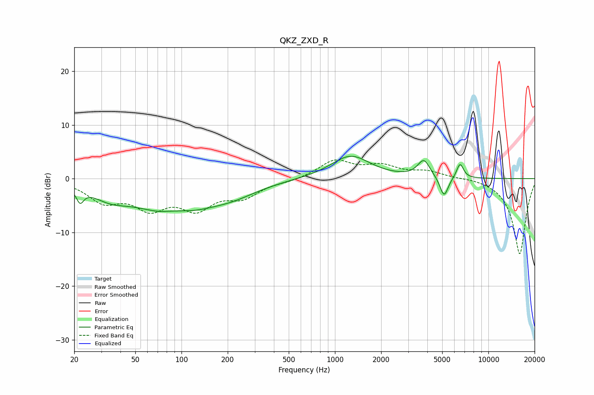

# QKZ_ZXD_R
See [usage instructions](https://github.com/jaakkopasanen/AutoEq#usage) for more options and info.

### Parametric EQs
Apply preamp of -4.3 dB when using parametric equalizer.

|   # | Type    |   Fc (Hz) |    Q |   Gain (dB) |
|-----|---------|-----------|------|-------------|
|   1 | Peaking |        22 | 5.97 |        -2.5 |
|   2 | Peaking |        34 | 1.23 |        -2.1 |
|   3 | Peaking |        85 | 2.4  |         0.4 |
|   4 | Peaking |        89 | 0.55 |        -6.2 |
|   5 | Peaking |       102 | 2.06 |         0.5 |
|   6 | Peaking |       219 | 0.87 |        -1.6 |
|   7 | Peaking |      1264 | 1.11 |         4.3 |
|   8 | Peaking |      3796 | 3.55 |         3.2 |
|   9 | Peaking |      5141 | 5.05 |        -3.8 |
|  10 | Peaking |      6532 | 6    |         2.8 |

### Fixed Band EQs
When using fixed band (also called graphic) equalizer, apply preamp of **-3.6 dB** (if available) and set gains manually with these parameters.

|   # | Type    |   Fc (Hz) |    Q |   Gain (dB) |
|-----|---------|-----------|------|-------------|
|   1 | Peaking |        31 | 1.41 |        -3.8 |
|   2 | Peaking |        62 | 1.41 |        -4.7 |
|   3 | Peaking |       125 | 1.41 |        -4.9 |
|   4 | Peaking |       250 | 1.41 |        -3   |
|   5 | Peaking |       500 | 1.41 |        -0.4 |
|   6 | Peaking |      1000 | 1.41 |         3.3 |
|   7 | Peaking |      2000 | 1.41 |         2.1 |
|   8 | Peaking |      4000 | 1.41 |         1.2 |
|   9 | Peaking |      8000 | 1.41 |         0.2 |
|  10 | Peaking |     16000 | 1.41 |       -14.1 |

### Graphs

