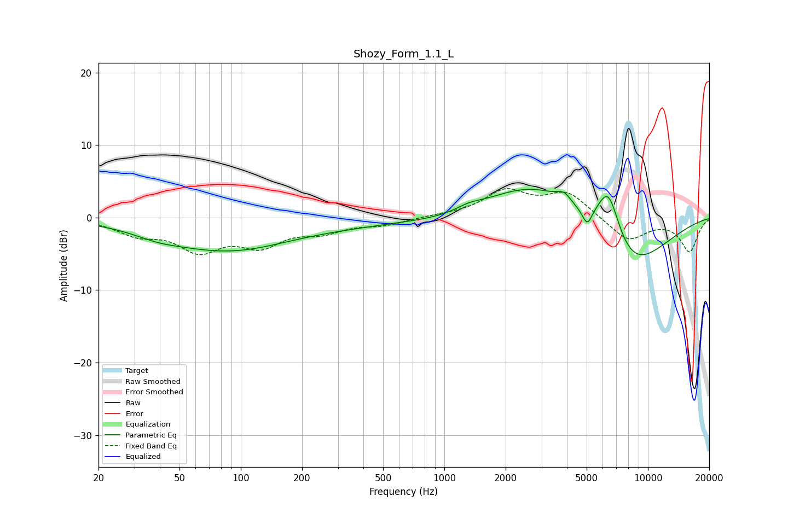

# Shozy_Form_1.1_L
See [usage instructions](https://github.com/jaakkopasanen/AutoEq#usage) for more options and info.

### Parametric EQs
Apply preamp of -4.0 dB when using parametric equalizer.

|   # | Type    |   Fc (Hz) |    Q |   Gain (dB) |
|-----|---------|-----------|------|-------------|
|   1 | Peaking |        39 | 1.23 |        -0.8 |
|   2 | Peaking |        86 | 0.46 |        -4.4 |
|   3 | Peaking |       364 | 0.55 |        -0.6 |
|   4 | Peaking |      1029 | 0.73 |        -0.8 |
|   5 | Peaking |      1315 | 2.24 |         0.6 |
|   6 | Peaking |      2873 | 0.58 |         5.4 |
|   7 | Peaking |      3873 | 4.01 |         1.2 |
|   8 | Peaking |      5035 | 5.99 |        -2.2 |
|   9 | Peaking |      6397 | 2.29 |         7.9 |
|  10 | Peaking |      7895 | 0.71 |        -8.4 |

### Fixed Band EQs
When using fixed band (also called graphic) equalizer, apply preamp of **-4.1 dB** (if available) and set gains manually with these parameters.

|   # | Type    |   Fc (Hz) |    Q |   Gain (dB) |
|-----|---------|-----------|------|-------------|
|   1 | Peaking |        31 | 1.41 |        -2   |
|   2 | Peaking |        62 | 1.41 |        -4.1 |
|   3 | Peaking |       125 | 1.41 |        -3.4 |
|   4 | Peaking |       250 | 1.41 |        -1.7 |
|   5 | Peaking |       500 | 1.41 |        -0.9 |
|   6 | Peaking |      1000 | 1.41 |         0.2 |
|   7 | Peaking |      2000 | 1.41 |         3.5 |
|   8 | Peaking |      4000 | 1.41 |         3.3 |
|   9 | Peaking |      8000 | 1.41 |        -3.2 |
|  10 | Peaking |     16000 | 1.41 |        -4.6 |

### Graphs

