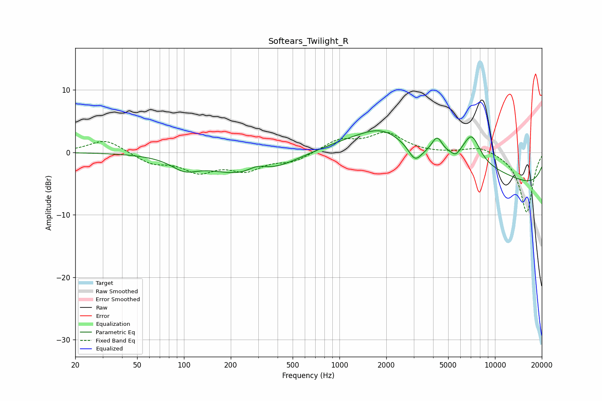

# Softears_Twilight_R
See [usage instructions](https://github.com/jaakkopasanen/AutoEq#usage) for more options and info.

### Parametric EQs
Apply preamp of -3.6 dB when using parametric equalizer.

|   # | Type    |   Fc (Hz) |    Q |   Gain (dB) |
|-----|---------|-----------|------|-------------|
|   1 | Peaking |       101 | 1.7  |        -1.8 |
|   2 | Peaking |       276 | 0.58 |        -4.2 |
|   3 | Peaking |       296 | 2.02 |         1.5 |
|   4 | Peaking |      1874 | 1.02 |         2.4 |
|   5 | Peaking |      3061 | 3.31 |        -2.5 |
|   6 | Peaking |      4243 | 4.08 |         2.7 |
|   7 | Peaking |      4426 | 0.2  |         6   |
|   8 | Peaking |      5595 | 5.58 |        -0.8 |
|   9 | Peaking |      7074 | 2.4  |         4.6 |
|  10 | Peaking |      9640 | 0.18 |        -8.2 |

### Fixed Band EQs
When using fixed band (also called graphic) equalizer, apply preamp of **-3.3 dB** (if available) and set gains manually with these parameters.

|   # | Type    |   Fc (Hz) |    Q |   Gain (dB) |
|-----|---------|-----------|------|-------------|
|   1 | Peaking |        31 | 1.41 |         2.1 |
|   2 | Peaking |        62 | 1.41 |        -1.7 |
|   3 | Peaking |       125 | 1.41 |        -2.8 |
|   4 | Peaking |       250 | 1.41 |        -2.5 |
|   5 | Peaking |       500 | 1.41 |        -1.4 |
|   6 | Peaking |      1000 | 1.41 |         1.9 |
|   7 | Peaking |      2000 | 1.41 |         3   |
|   8 | Peaking |      4000 | 1.41 |        -0.1 |
|   9 | Peaking |      8000 | 1.41 |         1.1 |
|  10 | Peaking |     16000 | 1.41 |        -9.7 |

### Graphs

