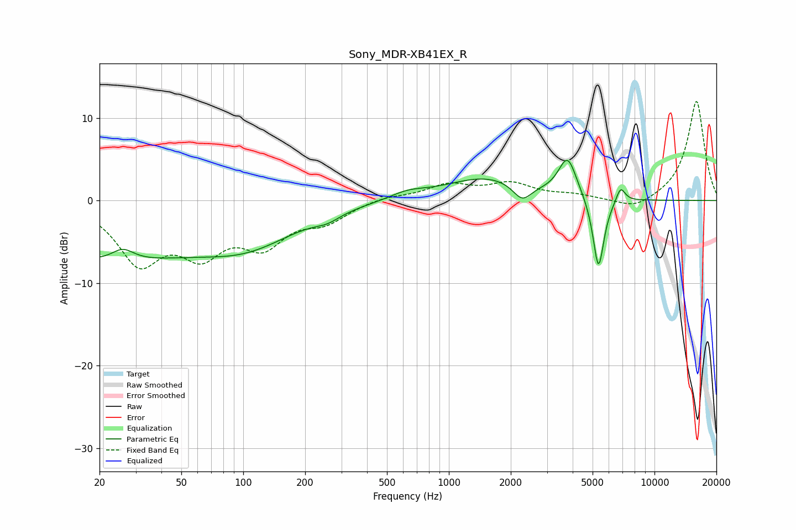

# Sony_MDR-XB41EX_R
See [usage instructions](https://github.com/jaakkopasanen/AutoEq#usage) for more options and info.

### Parametric EQs
Apply preamp of -5.0 dB when using parametric equalizer.

|   # | Type    |   Fc (Hz) |    Q |   Gain (dB) |
|-----|---------|-----------|------|-------------|
|   1 | Peaking |        20 | 0.3  |        -6.9 |
|   2 | Peaking |        26 | 2.65 |         1.5 |
|   3 | Peaking |       106 | 0.58 |        -4.2 |
|   4 | Peaking |       256 | 2.29 |        -0.8 |
|   5 | Peaking |       629 | 1.65 |         0.8 |
|   6 | Peaking |      1534 | 0.69 |         2.8 |
|   7 | Peaking |      2274 | 3.1  |        -2.1 |
|   8 | Peaking |      3779 | 3.19 |         4.8 |
|   9 | Peaking |      5340 | 5.08 |        -9   |
|  10 | Peaking |      6840 | 6    |         1.9 |

### Fixed Band EQs
When using fixed band (also called graphic) equalizer, apply preamp of **-12.1 dB** (if available) and set gains manually with these parameters.

|   # | Type    |   Fc (Hz) |    Q |   Gain (dB) |
|-----|---------|-----------|------|-------------|
|   1 | Peaking |        31 | 1.41 |        -7   |
|   2 | Peaking |        62 | 1.41 |        -5.4 |
|   3 | Peaking |       125 | 1.41 |        -4.7 |
|   4 | Peaking |       250 | 1.41 |        -2.2 |
|   5 | Peaking |       500 | 1.41 |         0.5 |
|   6 | Peaking |      1000 | 1.41 |         1.8 |
|   7 | Peaking |      2000 | 1.41 |         1.9 |
|   8 | Peaking |      4000 | 1.41 |         0.6 |
|   9 | Peaking |      8000 | 1.41 |        -1.3 |
|  10 | Peaking |     16000 | 1.41 |        12.1 |

### Graphs

