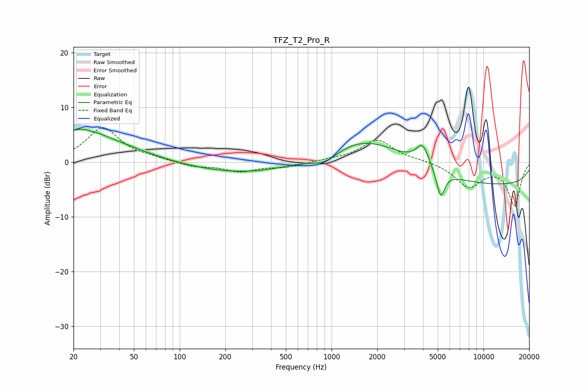

# TFZ_T2_Pro_R
See [usage instructions](https://github.com/jaakkopasanen/AutoEq#usage) for more options and info.

### Parametric EQs
Apply preamp of -6.1 dB when using parametric equalizer.

|   # | Type    |   Fc (Hz) |    Q |   Gain (dB) |
|-----|---------|-----------|------|-------------|
|   1 | Peaking |        21 | 1.33 |         1.5 |
|   2 | Peaking |        25 | 0.5  |         4.6 |
|   3 | Peaking |        27 | 5.9  |        -3.3 |
|   4 | Peaking |        27 | 5.69 |         3.3 |
|   5 | Peaking |       339 | 0.32 |        -2.5 |
|   6 | Peaking |       907 | 1.5  |        -2.2 |
|   7 | Peaking |      1635 | 0.46 |         6.2 |
|   8 | Peaking |      3970 | 3.29 |         3.9 |
|   9 | Peaking |      5230 | 5.14 |        -4.9 |
|  10 | Peaking |     10000 | 0.18 |        -4.3 |

### Fixed Band EQs
When using fixed band (also called graphic) equalizer, apply preamp of **-6.4 dB** (if available) and set gains manually with these parameters.

|   # | Type    |   Fc (Hz) |    Q |   Gain (dB) |
|-----|---------|-----------|------|-------------|
|   1 | Peaking |        31 | 1.41 |         6.2 |
|   2 | Peaking |        62 | 1.41 |         0.5 |
|   3 | Peaking |       125 | 1.41 |        -0.8 |
|   4 | Peaking |       250 | 1.41 |        -1.6 |
|   5 | Peaking |       500 | 1.41 |        -0.9 |
|   6 | Peaking |      1000 | 1.41 |         0.3 |
|   7 | Peaking |      2000 | 1.41 |         4.1 |
|   8 | Peaking |      4000 | 1.41 |         0.3 |
|   9 | Peaking |      8000 | 1.41 |        -4.4 |
|  10 | Peaking |     16000 | 1.41 |        -7.8 |

### Graphs

