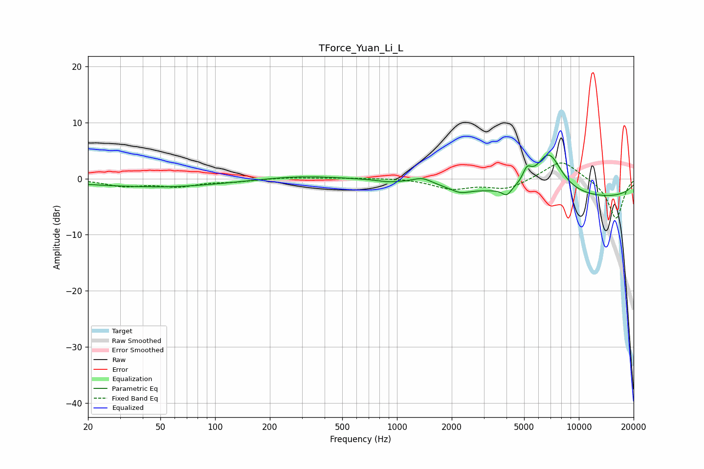

# TForce_Yuan_Li_L
See [usage instructions](https://github.com/jaakkopasanen/AutoEq#usage) for more options and info.

### Parametric EQs
Apply preamp of -4.3 dB when using parametric equalizer.

|   # | Type    |   Fc (Hz) |    Q |   Gain (dB) |
|-----|---------|-----------|------|-------------|
|   1 | Peaking |        46 | 0.32 |        -1.4 |
|   2 | Peaking |        57 | 1.15 |        -0.1 |
|   3 | Peaking |       287 | 0.64 |         0.7 |
|   4 | Peaking |       895 | 2.7  |        -0.3 |
|   5 | Peaking |      1383 | 2.69 |         1.1 |
|   6 | Peaking |      2226 | 2.79 |        -0.9 |
|   7 | Peaking |      4015 | 5.61 |        -1.4 |
|   8 | Peaking |      5185 | 5.84 |         2.3 |
|   9 | Peaking |      6826 | 1.81 |         7.5 |
|  10 | Peaking |      9693 | 0.18 |        -3.6 |

### Fixed Band EQs
When using fixed band (also called graphic) equalizer, apply preamp of **-2.9 dB** (if available) and set gains manually with these parameters.

|   # | Type    |   Fc (Hz) |    Q |   Gain (dB) |
|-----|---------|-----------|------|-------------|
|   1 | Peaking |        31 | 1.41 |        -1.2 |
|   2 | Peaking |        62 | 1.41 |        -1.2 |
|   3 | Peaking |       125 | 1.41 |        -0.4 |
|   4 | Peaking |       250 | 1.41 |         0.2 |
|   5 | Peaking |       500 | 1.41 |         0.1 |
|   6 | Peaking |      1000 | 1.41 |         0.1 |
|   7 | Peaking |      2000 | 1.41 |        -1.7 |
|   8 | Peaking |      4000 | 1.41 |        -1.8 |
|   9 | Peaking |      8000 | 1.41 |         3.5 |
|  10 | Peaking |     16000 | 1.41 |        -7.2 |

### Graphs

