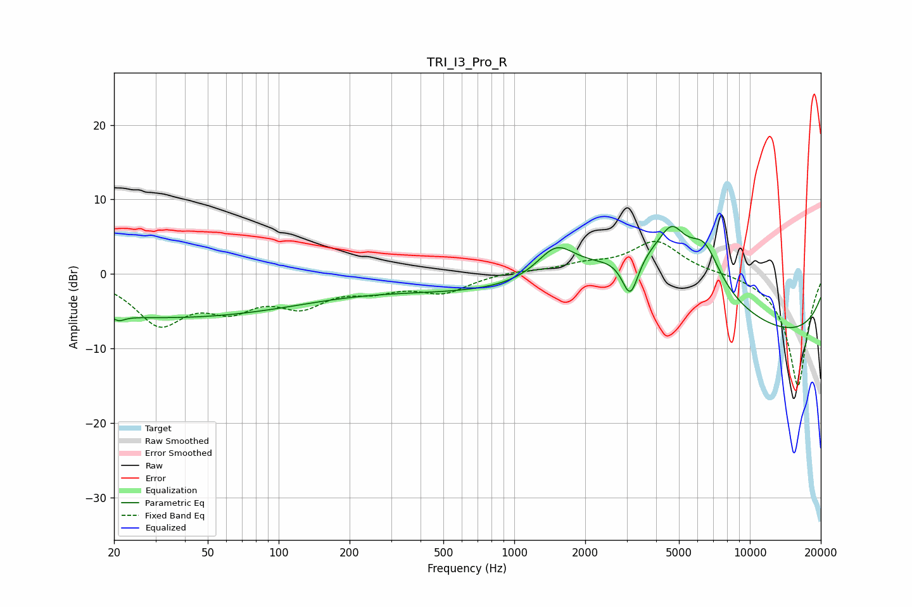

# TRI_I3_Pro_R
See [usage instructions](https://github.com/jaakkopasanen/AutoEq#usage) for more options and info.

### Parametric EQs
Apply preamp of -6.5 dB when using parametric equalizer.

|   # | Type    |   Fc (Hz) |    Q |   Gain (dB) |
|-----|---------|-----------|------|-------------|
|   1 | Peaking |        21 | 5.54 |         3.4 |
|   2 | Peaking |        21 | 5.56 |        -4.1 |
|   3 | Peaking |        32 | 0.21 |        -5.8 |
|   4 | Peaking |       813 | 0.31 |        -2.4 |
|   5 | Peaking |      1506 | 1.71 |         4.4 |
|   6 | Peaking |      3107 | 3.92 |        -5.9 |
|   7 | Peaking |      3868 | 0.53 |        10   |
|   8 | Peaking |      4668 | 2.74 |         3.8 |
|   9 | Peaking |      6410 | 2.03 |         5.3 |
|  10 | Peaking |     10000 | 0.18 |        -9.1 |

### Fixed Band EQs
When using fixed band (also called graphic) equalizer, apply preamp of **-4.5 dB** (if available) and set gains manually with these parameters.

|   # | Type    |   Fc (Hz) |    Q |   Gain (dB) |
|-----|---------|-----------|------|-------------|
|   1 | Peaking |        31 | 1.41 |        -6.3 |
|   2 | Peaking |        62 | 1.41 |        -3.7 |
|   3 | Peaking |       125 | 1.41 |        -3.6 |
|   4 | Peaking |       250 | 1.41 |        -1.7 |
|   5 | Peaking |       500 | 1.41 |        -2.3 |
|   6 | Peaking |      1000 | 1.41 |         0.4 |
|   7 | Peaking |      2000 | 1.41 |         1.1 |
|   8 | Peaking |      4000 | 1.41 |         4.4 |
|   9 | Peaking |      8000 | 1.41 |         0.2 |
|  10 | Peaking |     16000 | 1.41 |       -15.1 |

### Graphs

