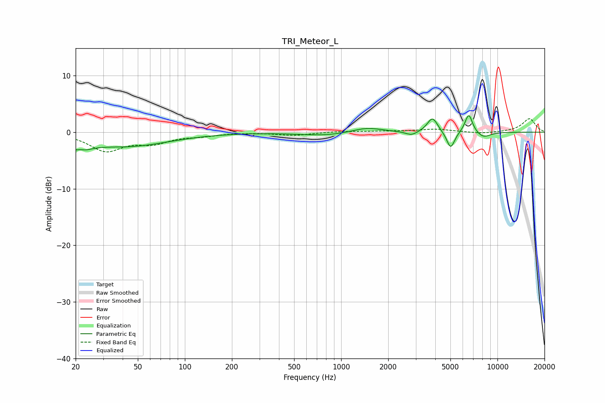

# TRI_Meteor_L
See [usage instructions](https://github.com/jaakkopasanen/AutoEq#usage) for more options and info.

### Parametric EQs
Apply preamp of -3.0 dB when using parametric equalizer.

|   # | Type    |   Fc (Hz) |    Q |   Gain (dB) |
|-----|---------|-----------|------|-------------|
|   1 | Peaking |        21 | 2.36 |        -2.7 |
|   2 | Peaking |        21 | 4.31 |         1.1 |
|   3 | Peaking |        43 | 0.52 |        -2.4 |
|   4 | Peaking |       793 | 0.84 |        -0.6 |
|   5 | Peaking |      1458 | 1.43 |         0.9 |
|   6 | Peaking |      2821 | 3.74 |        -0.7 |
|   7 | Peaking |      3840 | 4.25 |         2.6 |
|   8 | Peaking |      5019 | 5.44 |        -3.1 |
|   9 | Peaking |      6550 | 5.65 |         3.4 |
|  10 | Peaking |      8130 | 2.9  |        -1   |

### Fixed Band EQs
When using fixed band (also called graphic) equalizer, apply preamp of **-2.5 dB** (if available) and set gains manually with these parameters.

|   # | Type    |   Fc (Hz) |    Q |   Gain (dB) |
|-----|---------|-----------|------|-------------|
|   1 | Peaking |        31 | 1.41 |        -3.2 |
|   2 | Peaking |        62 | 1.41 |        -1.7 |
|   3 | Peaking |       125 | 1.41 |        -0.5 |
|   4 | Peaking |       250 | 1.41 |        -0   |
|   5 | Peaking |       500 | 1.41 |        -0.6 |
|   6 | Peaking |      1000 | 1.41 |         0.2 |
|   7 | Peaking |      2000 | 1.41 |         0.1 |
|   8 | Peaking |      4000 | 1.41 |         0.5 |
|   9 | Peaking |      8000 | 1.41 |        -0.3 |
|  10 | Peaking |     16000 | 1.41 |         2.4 |

### Graphs

