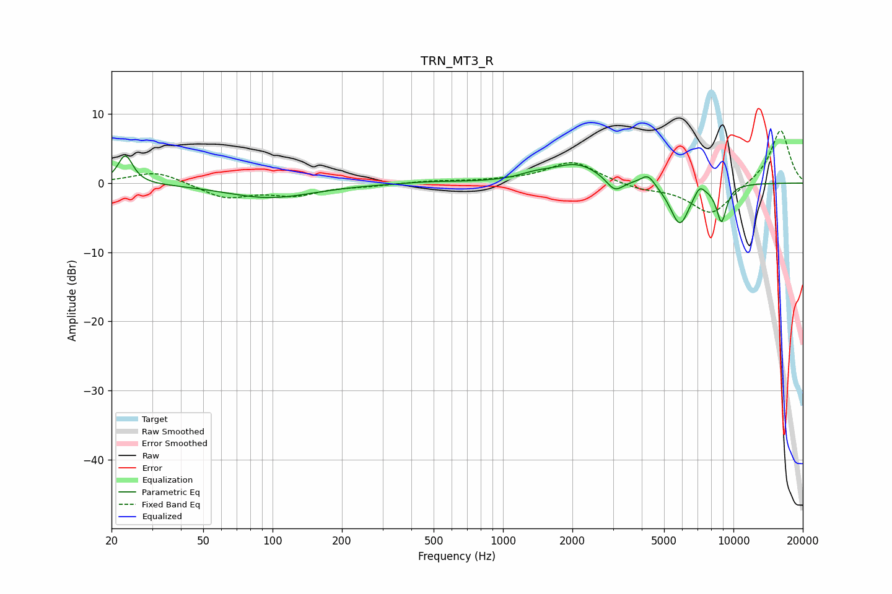

# TRN_MT3_R
See [usage instructions](https://github.com/jaakkopasanen/AutoEq#usage) for more options and info.

### Parametric EQs
Apply preamp of -4.0 dB when using parametric equalizer.

|   # | Type    |   Fc (Hz) |    Q |   Gain (dB) |
|-----|---------|-----------|------|-------------|
|   1 | Peaking |        23 | 4.49 |         4.1 |
|   2 | Peaking |        97 | 0.74 |        -2.1 |
|   3 | Peaking |       483 | 1.31 |         0.2 |
|   4 | Peaking |      1381 | 1.94 |         0.7 |
|   5 | Peaking |      2096 | 1.32 |         2.7 |
|   6 | Peaking |      3054 | 3.81 |        -2   |
|   7 | Peaking |      4254 | 4.58 |         1.6 |
|   8 | Peaking |      5852 | 3.18 |        -6.1 |
|   9 | Peaking |      7127 | 5.99 |         1.4 |
|  10 | Peaking |      8878 | 5.72 |        -5.3 |

### Fixed Band EQs
When using fixed band (also called graphic) equalizer, apply preamp of **-7.7 dB** (if available) and set gains manually with these parameters.

|   # | Type    |   Fc (Hz) |    Q |   Gain (dB) |
|-----|---------|-----------|------|-------------|
|   1 | Peaking |        31 | 1.41 |         1.8 |
|   2 | Peaking |        62 | 1.41 |        -2.1 |
|   3 | Peaking |       125 | 1.41 |        -1.6 |
|   4 | Peaking |       250 | 1.41 |        -0.3 |
|   5 | Peaking |       500 | 1.41 |         0.3 |
|   6 | Peaking |      1000 | 1.41 |         0.3 |
|   7 | Peaking |      2000 | 1.41 |         3.1 |
|   8 | Peaking |      4000 | 1.41 |        -0.8 |
|   9 | Peaking |      8000 | 1.41 |        -4.6 |
|  10 | Peaking |     16000 | 1.41 |         7.8 |

### Graphs

