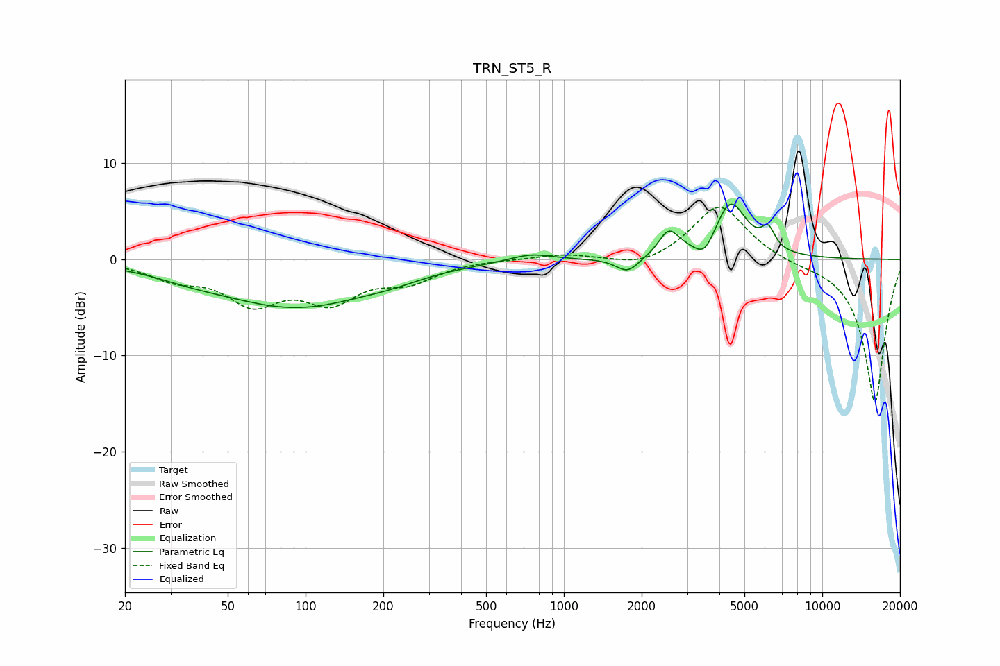

# TRN_ST5_R
See [usage instructions](https://github.com/jaakkopasanen/AutoEq#usage) for more options and info.

### Parametric EQs
Apply preamp of -5.8 dB when using parametric equalizer.

|   # | Type    |   Fc (Hz) |    Q |   Gain (dB) |
|-----|---------|-----------|------|-------------|
|   1 | Peaking |        36 | 1.03 |        -0.6 |
|   2 | Peaking |        92 | 0.47 |        -4.8 |
|   3 | Peaking |       217 | 1.27 |        -0.5 |
|   4 | Peaking |       745 | 1.69 |         0.8 |
|   5 | Peaking |      1766 | 3.16 |        -1.6 |
|   6 | Peaking |      2526 | 4.03 |         1.9 |
|   7 | Peaking |      2664 | 2.86 |         0.9 |
|   8 | Peaking |      3515 | 3.58 |        -2   |
|   9 | Peaking |      4409 | 2.21 |         6   |
|  10 | Peaking |      6180 | 5.39 |         2.1 |

### Fixed Band EQs
When using fixed band (also called graphic) equalizer, apply preamp of **-5.5 dB** (if available) and set gains manually with these parameters.

|   # | Type    |   Fc (Hz) |    Q |   Gain (dB) |
|-----|---------|-----------|------|-------------|
|   1 | Peaking |        31 | 1.41 |        -1.7 |
|   2 | Peaking |        62 | 1.41 |        -4.1 |
|   3 | Peaking |       125 | 1.41 |        -3.8 |
|   4 | Peaking |       250 | 1.41 |        -2   |
|   5 | Peaking |       500 | 1.41 |         0   |
|   6 | Peaking |      1000 | 1.41 |         0.6 |
|   7 | Peaking |      2000 | 1.41 |        -1   |
|   8 | Peaking |      4000 | 1.41 |         5.8 |
|   9 | Peaking |      8000 | 1.41 |        -0.3 |
|  10 | Peaking |     16000 | 1.41 |       -15   |

### Graphs

