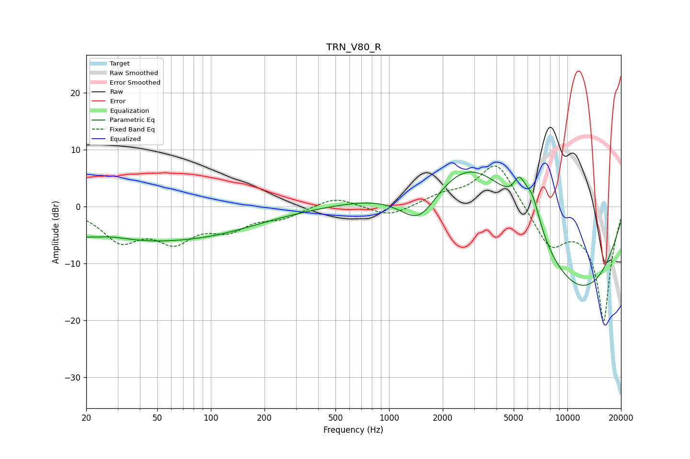

# TRN_V80_R
See [usage instructions](https://github.com/jaakkopasanen/AutoEq#usage) for more options and info.

### Parametric EQs
Apply preamp of -6.2 dB when using parametric equalizer.

|   # | Type    |   Fc (Hz) |    Q |   Gain (dB) |
|-----|---------|-----------|------|-------------|
|   1 | Peaking |        27 | 1.26 |         0.9 |
|   2 | Peaking |        36 | 0.21 |        -6.3 |
|   3 | Peaking |       116 | 0.79 |        -0.3 |
|   4 | Peaking |      1478 | 1.16 |        -8   |
|   5 | Peaking |      2869 | 0.46 |        12.1 |
|   6 | Peaking |      5377 | 4.31 |         4   |
|   7 | Peaking |      5824 | 0.45 |         4.7 |
|   8 | Peaking |      6323 | 2.74 |         6   |
|   9 | Peaking |     10000 | 0.34 |       -11.6 |
|  10 | Peaking |     10000 | 0.33 |        -7.7 |

### Fixed Band EQs
When using fixed band (also called graphic) equalizer, apply preamp of **-7.3 dB** (if available) and set gains manually with these parameters.

|   # | Type    |   Fc (Hz) |    Q |   Gain (dB) |
|-----|---------|-----------|------|-------------|
|   1 | Peaking |        31 | 1.41 |        -5.5 |
|   2 | Peaking |        62 | 1.41 |        -5.3 |
|   3 | Peaking |       125 | 1.41 |        -3.4 |
|   4 | Peaking |       250 | 1.41 |        -1.7 |
|   5 | Peaking |       500 | 1.41 |         1.8 |
|   6 | Peaking |      1000 | 1.41 |        -1.9 |
|   7 | Peaking |      2000 | 1.41 |         1.6 |
|   8 | Peaking |      4000 | 1.41 |         8.2 |
|   9 | Peaking |      8000 | 1.41 |        -6.5 |
|  10 | Peaking |     16000 | 1.41 |       -20   |

### Graphs

