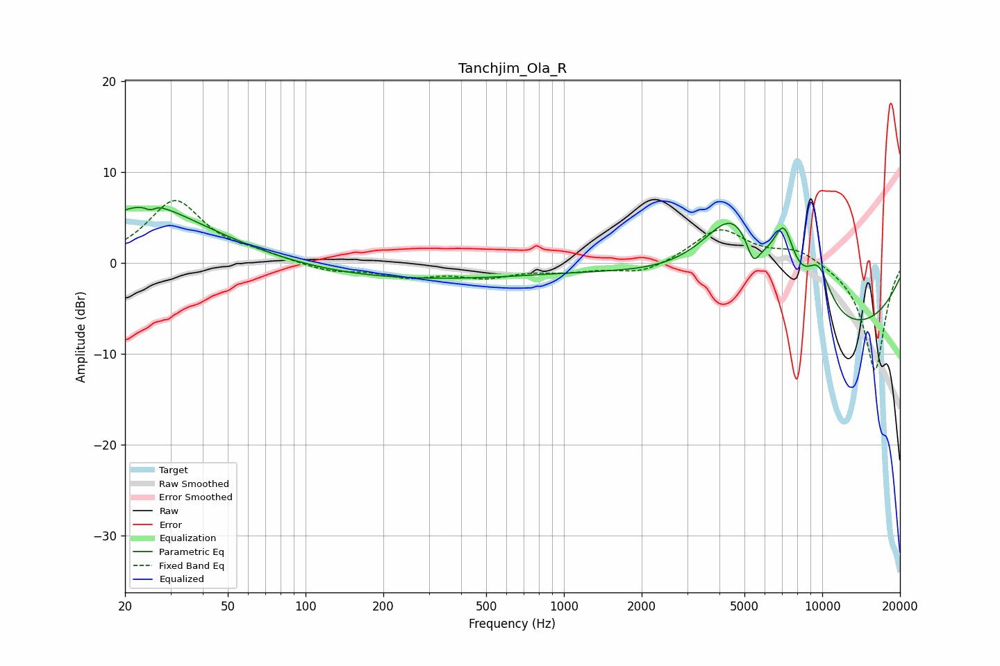

# Tanchjim_Ola_R
See [usage instructions](https://github.com/jaakkopasanen/AutoEq#usage) for more options and info.

### Parametric EQs
Apply preamp of -6.2 dB when using parametric equalizer.

|   # | Type    |   Fc (Hz) |    Q |   Gain (dB) |
|-----|---------|-----------|------|-------------|
|   1 | Peaking |        23 | 0.72 |         5.6 |
|   2 | Peaking |        25 | 5.88 |        -2.4 |
|   3 | Peaking |        26 | 5.34 |         2.1 |
|   4 | Peaking |        46 | 0.53 |         1.3 |
|   5 | Peaking |       249 | 0.27 |        -1.8 |
|   6 | Peaking |      4536 | 1.03 |        10.2 |
|   7 | Peaking |      5407 | 5.2  |        -2.8 |
|   8 | Peaking |      7098 | 3.21 |         6   |
|   9 | Peaking |      9667 | 2.34 |         5.1 |
|  10 | Peaking |     10000 | 0.27 |        -8.3 |

### Fixed Band EQs
When using fixed band (also called graphic) equalizer, apply preamp of **-7.0 dB** (if available) and set gains manually with these parameters.

|   # | Type    |   Fc (Hz) |    Q |   Gain (dB) |
|-----|---------|-----------|------|-------------|
|   1 | Peaking |        31 | 1.41 |         6.8 |
|   2 | Peaking |        62 | 1.41 |         0.7 |
|   3 | Peaking |       125 | 1.41 |        -0.9 |
|   4 | Peaking |       250 | 1.41 |        -1.4 |
|   5 | Peaking |       500 | 1.41 |        -1.4 |
|   6 | Peaking |      1000 | 1.41 |        -0.7 |
|   7 | Peaking |      2000 | 1.41 |        -1.2 |
|   8 | Peaking |      4000 | 1.41 |         3.8 |
|   9 | Peaking |      8000 | 1.41 |         1.6 |
|  10 | Peaking |     16000 | 1.41 |       -11.9 |

### Graphs

