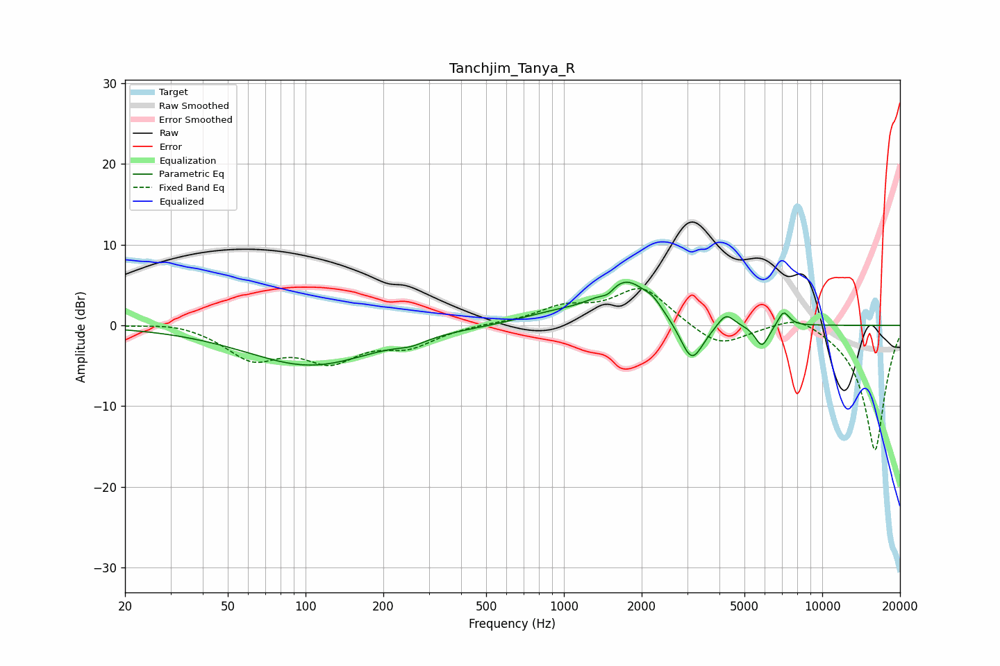

# Tanchjim_Tanya_R
See [usage instructions](https://github.com/jaakkopasanen/AutoEq#usage) for more options and info.

### Parametric EQs
Apply preamp of -5.4 dB when using parametric equalizer.

|   # | Type    |   Fc (Hz) |    Q |   Gain (dB) |
|-----|---------|-----------|------|-------------|
|   1 | Peaking |       104 | 0.57 |        -4.9 |
|   2 | Peaking |       258 | 2.59 |        -0.7 |
|   3 | Peaking |       890 | 1.05 |         1   |
|   4 | Peaking |      1478 | 5.37 |        -0.9 |
|   5 | Peaking |      1732 | 1.43 |         5.5 |
|   6 | Peaking |      2215 | 4.48 |         0.8 |
|   7 | Peaking |      3125 | 3.06 |        -5.3 |
|   8 | Peaking |      4237 | 4.46 |         1.7 |
|   9 | Peaking |      5847 | 5.07 |        -2.8 |
|  10 | Peaking |      7084 | 6    |         1.9 |

### Fixed Band EQs
When using fixed band (also called graphic) equalizer, apply preamp of **-4.6 dB** (if available) and set gains manually with these parameters.

|   # | Type    |   Fc (Hz) |    Q |   Gain (dB) |
|-----|---------|-----------|------|-------------|
|   1 | Peaking |        31 | 1.41 |         0.6 |
|   2 | Peaking |        62 | 1.41 |        -3.8 |
|   3 | Peaking |       125 | 1.41 |        -3.9 |
|   4 | Peaking |       250 | 1.41 |        -2.3 |
|   5 | Peaking |       500 | 1.41 |         0.2 |
|   6 | Peaking |      1000 | 1.41 |         2   |
|   7 | Peaking |      2000 | 1.41 |         4.7 |
|   8 | Peaking |      4000 | 1.41 |        -2.8 |
|   9 | Peaking |      8000 | 1.41 |         1.7 |
|  10 | Peaking |     16000 | 1.41 |       -15.6 |

### Graphs

