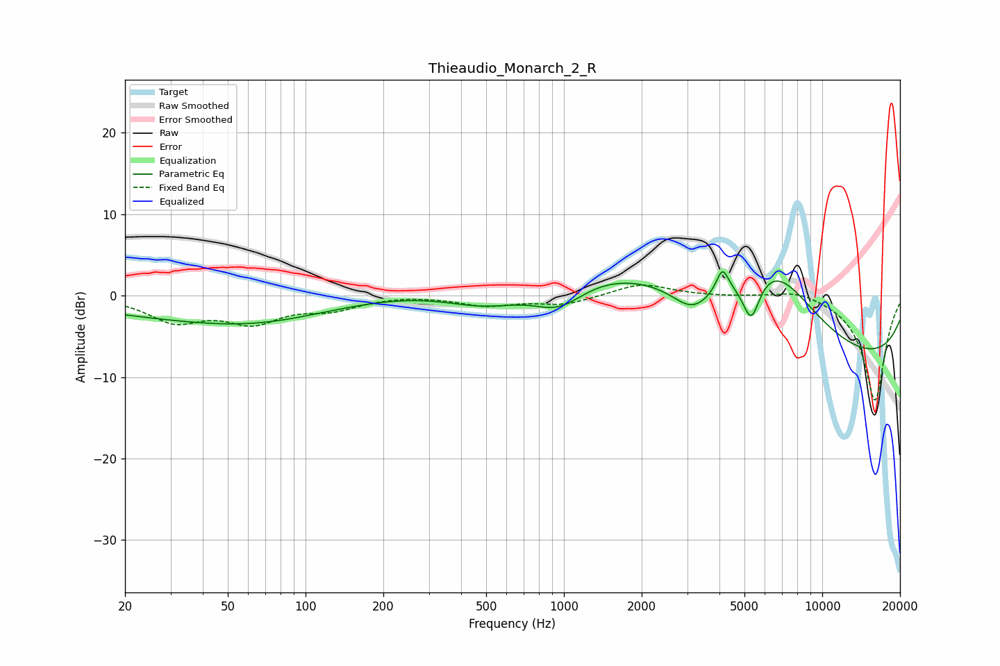

# Thieaudio_Monarch_2_R
See [usage instructions](https://github.com/jaakkopasanen/AutoEq#usage) for more options and info.

### Parametric EQs
Apply preamp of -3.1 dB when using parametric equalizer.

|   # | Type    |   Fc (Hz) |    Q |   Gain (dB) |
|-----|---------|-----------|------|-------------|
|   1 | Peaking |        36 | 0.33 |        -2.3 |
|   2 | Peaking |        68 | 0.54 |        -1.4 |
|   3 | Peaking |       511 | 0.75 |        -4.2 |
|   4 | Peaking |       957 | 1.31 |        -3.8 |
|   5 | Peaking |      1560 | 0.23 |         6.4 |
|   6 | Peaking |      3140 | 1.82 |        -3.1 |
|   7 | Peaking |      4109 | 6    |         3   |
|   8 | Peaking |      5308 | 4.15 |        -5.3 |
|   9 | Peaking |      6486 | 0.8  |         8.4 |
|  10 | Peaking |     10000 | 0.18 |        -8.8 |

### Fixed Band EQs
When using fixed band (also called graphic) equalizer, apply preamp of **-1.4 dB** (if available) and set gains manually with these parameters.

|   # | Type    |   Fc (Hz) |    Q |   Gain (dB) |
|-----|---------|-----------|------|-------------|
|   1 | Peaking |        31 | 1.41 |        -3   |
|   2 | Peaking |        62 | 1.41 |        -2.9 |
|   3 | Peaking |       125 | 1.41 |        -1.5 |
|   4 | Peaking |       250 | 1.41 |         0.1 |
|   5 | Peaking |       500 | 1.41 |        -1.1 |
|   6 | Peaking |      1000 | 1.41 |        -1.1 |
|   7 | Peaking |      2000 | 1.41 |         1.5 |
|   8 | Peaking |      4000 | 1.41 |        -0.1 |
|   9 | Peaking |      8000 | 1.41 |         0.9 |
|  10 | Peaking |     16000 | 1.41 |       -13   |

### Graphs

