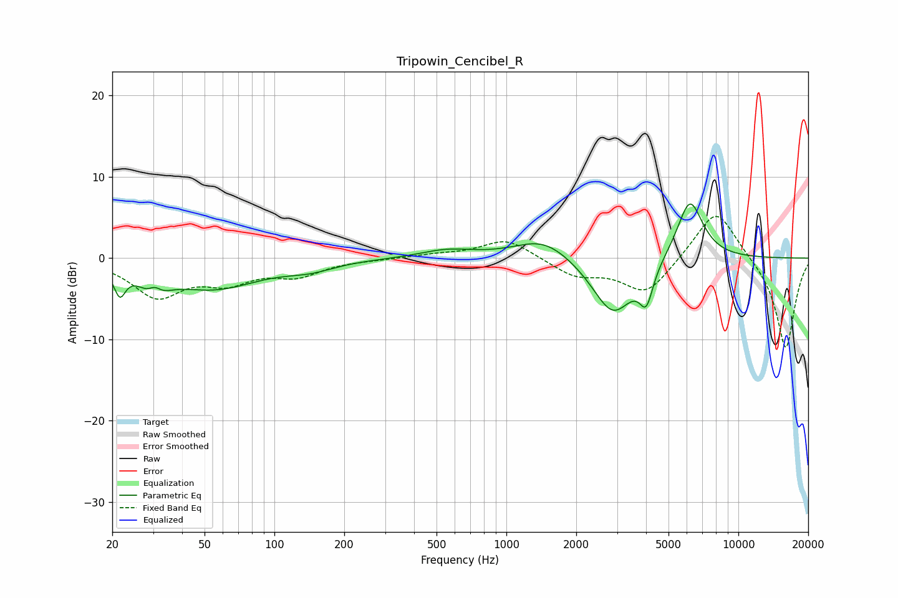

# Tripowin_Cencibel_R
See [usage instructions](https://github.com/jaakkopasanen/AutoEq#usage) for more options and info.

### Parametric EQs
Apply preamp of -6.8 dB when using parametric equalizer.

|   # | Type    |   Fc (Hz) |    Q |   Gain (dB) |
|-----|---------|-----------|------|-------------|
|   1 | Peaking |        22 | 5.87 |        -3.1 |
|   2 | Peaking |        30 | 2.8  |        -3.8 |
|   3 | Peaking |        30 | 4.58 |         2.4 |
|   4 | Peaking |        55 | 0.72 |        -3.6 |
|   5 | Peaking |       142 | 1.35 |        -0.9 |
|   6 | Peaking |       555 | 1.24 |         1   |
|   7 | Peaking |      1451 | 1.14 |         2.7 |
|   8 | Peaking |      2881 | 1.54 |        -7.2 |
|   9 | Peaking |      4012 | 4.84 |        -4.2 |
|  10 | Peaking |      6177 | 2.39 |         7.6 |

### Fixed Band EQs
When using fixed band (also called graphic) equalizer, apply preamp of **-5.2 dB** (if available) and set gains manually with these parameters.

|   # | Type    |   Fc (Hz) |    Q |   Gain (dB) |
|-----|---------|-----------|------|-------------|
|   1 | Peaking |        31 | 1.41 |        -4.5 |
|   2 | Peaking |        62 | 1.41 |        -2.5 |
|   3 | Peaking |       125 | 1.41 |        -1.9 |
|   4 | Peaking |       250 | 1.41 |        -0.1 |
|   5 | Peaking |       500 | 1.41 |         0.4 |
|   6 | Peaking |      1000 | 1.41 |         2.4 |
|   7 | Peaking |      2000 | 1.41 |        -2.1 |
|   8 | Peaking |      4000 | 1.41 |        -4.4 |
|   9 | Peaking |      8000 | 1.41 |         6.5 |
|  10 | Peaking |     16000 | 1.41 |       -11.3 |

### Graphs

